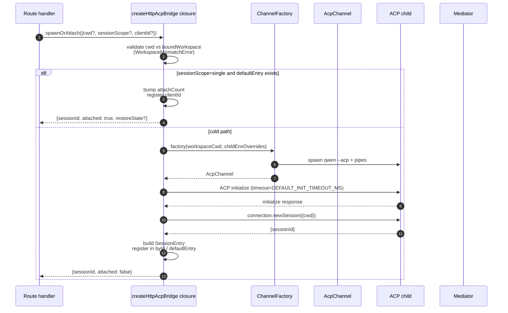
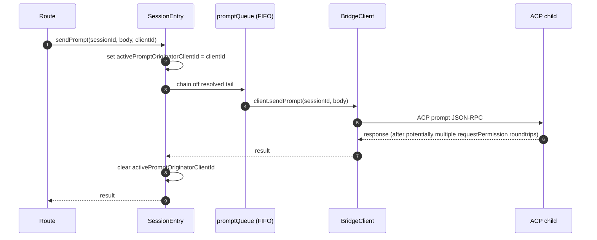
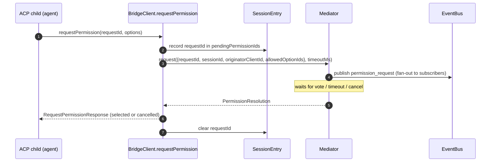
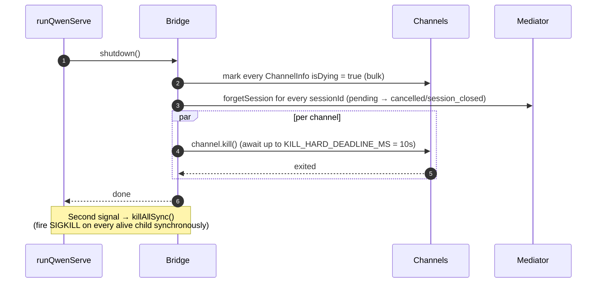

# ACP Bridge
## 概览

`packages/acp-bridge/` 包是 daemon HTTP 层与 ACP 子进程之间的缝隙拥有者。它被 `packages/cli/src/serve/`（`qwen serve` daemon）消费；在 #4175 F1 step 3 中被抽取出来，让以后的消费方（`channels/base/AcpBridge.ts`、VSCode IDE companion）可以直接复用 bridge 内核而不必反向依赖 cli 包。

bridge 提供：一个 `HttpAcpBridge` 实例、一条 `AcpChannel` 连到 ACP 子进程、在这条 channel 上多路复用的 session、每个 session 的 `EventBus`、一个 `MultiClientPermissionMediator`、一个 `BridgeFileSystem` adapter，外加 ACP 形状的辅助方法（`spawnOrAttach`、`loadSession`、`resumeSession`、`sendPrompt`、`cancelSession`、`respondToPermission`，以及供 workspace 级状态与 MCP 重启用的 extMethod RPC）。

## 职责

- 用可插拔的 `ChannelFactory` spawn 或 attach 到 ACP 子进程。默认 `defaultSpawnChannelFactory`（子进程 `qwen --acp`），测试用 `inMemoryChannel`。
- 维护 `aliveChannels`（channel 注册表）和 `byId`（session 注册表）。
- 用 `connection.newSession()` 在一条 ACP child 上多路复用 N 个 HTTP-side session。
- 用 `promptQueue` 把同一 session 的 prompt 串行化（ACP 强制 「一个 session 同一时刻只能有一个 prompt 在跑」）。
- 用 `modelChangeQueue` 串行化 `setSessionModel`，防止并发 attach + 不同 model 把 agent 带进非确定状态。
- 每个 session 一个 `EventBus`，驱动 `GET /session/:id/events`（详见 [`10-event-bus.md`](./10-event-bus.md)）。
- 权限流：`BridgeClient.requestPermission` → `MultiClientPermissionMediator.request` → 扇出 → 收票 → 回 ACP（详见 [`04-permission-mediation.md`](./04-permission-mediation.md)）。
- 文件 IO：通过 `BridgeFileSystem` adapter 处理 ACP 的 `readTextFile` / `writeTextFile`（详见 [`07-workspace-filesystem.md`](./07-workspace-filesystem.md)）。
- workspace 级状态的 extMethod RPC（`/workspace/mcp`、`/workspace/skills`、`/workspace/providers`）和 MCP 重启。
- 生命周期：`shutdown()` 每个 channel 等 `KILL_HARD_DEADLINE_MS`（10s）；二次信号 `killAllSync()` 同步强杀。

## 架构

**公开入口**：`createHttpAcpBridge(opts: BridgeOptions): HttpAcpBridge`，文件 `packages/acp-bridge/src/bridge.ts:350+`。

**关键类型**：

| 类型                            | 文件                           | 作用                                                                             |
| ------------------------------- | ------------------------------ | -------------------------------------------------------------------------------- |
| `HttpAcpBridge`                 | `bridgeTypes.ts:30-180+`       | 对外接口，全部方法都在这里                                                       |
| `BridgeSession`                 | `bridgeTypes.ts:49+`           | `{ sessionId, workspaceCwd, attached, clientId?, createdAt? }`                   |
| `BridgeOptions`                 | `bridgeOptions.ts:88-323`      | 构造时配置（见 [配置](#配置)）                                                   |
| `AcpChannel`                    | `channel.ts:21-50`             | `{ stream, kill(), killSync(), exited }` 一条 ACP NDJSON channel                 |
| `ChannelFactory`                | `channel.ts:57-60`             | `(workspaceCwd, childEnvOverrides?) => Promise<AcpChannel>`                      |
| `BridgeClient`                  | `bridgeClient.ts:1-150+`       | 封装一条 ACP `ClientSideConnection`，实现 ACP `Client`                           |
| `EventBus`                      | `eventBus.ts`                  | 每 session 内存 pub/sub，见 [`10-event-bus.md`](./10-event-bus.md)               |
| `MultiClientPermissionMediator` | `permissionMediator.ts:1-1292` | 四策略 mediator，见 [`04-permission-mediation.md`](./04-permission-mediation.md) |

**内部状态**（由 `createHttpAcpBridge` 闭包持有）：

| 状态            | 形态                            | 用途                                                                                                                                                                                                                                                                                                                               |
| --------------- | ------------------------------- | ---------------------------------------------------------------------------------------------------------------------------------------------------------------------------------------------------------------------------------------------------------------------------------------------------------------------------------- |
| `aliveChannels` | `Map<string, ChannelInfo>`      | channel 注册表；每条 `ChannelInfo` 包括 `channel`、`connection`、`client`（每 channel 一个 `BridgeClient`）、`sessionIds: Set<string>`、`pendingRestoreIds`、`statusClosedReject?`、`isDying: boolean`                                                                                                                             |
| `byId`          | `Map<string, SessionEntry>`     | session 注册表；每个 `SessionEntry` 包括 `channel`、`connection`、`events: EventBus`、`promptQueue`、`modelChangeQueue`、`pendingPermissionIds: Set<string>`、`clientIds: Map<string, count>`、`activePromptOriginatorClientId?`、`attachCount`、`spawnOwnerWantedKill`、`restoreState?`、`sessionLastSeenAt?`、`clientLastSeenAt` |
| `defaultEntry`  | `SessionEntry \| null`          | `sessionScope: 'single'` 下共享的那个 session                                                                                                                                                                                                                                                                                      |
| `defaultPolicy` | `PermissionPolicy`              | 由 `BridgeOptions.permissionPolicy` 决定                                                                                                                                                                                                                                                                                           |
| `mediator`      | `MultiClientPermissionMediator` | 每 bridge 一个                                                                                                                                                                                                                                                                                                                     |
| 常量            | —                               | `DEFAULT_INIT_TIMEOUT_MS = 10_000`、`MCP_RESTART_TIMEOUT_MS = 300_000`、`DEFAULT_MAX_SESSIONS = 20`、`MAX_EVENT_RING_SIZE = 1_000_000`、`DEFAULT_PERMISSION_TIMEOUT_MS = 5min`、`DEFAULT_MAX_PENDING_PER_SESSION = 64`                                                                                                             |

**`isDying` 不变式**：任何 teardown 路径在 await `channel.kill()` 之前必须**同步**置 `ChannelInfo.isDying = true`。`ensureChannel` 把 dying channel 视作不存在，会重新 spawn 一条。否则一个并发 `spawnOrAttach` 在 SIGTERM 宽限窗口（最长 10s）中到来时会 attach 到马上要关掉的 transport，调用方拿到的 sessionId 之后每次请求都 404。**设置位点**（必须同步保持）：`ensureChannel`（initialize 失败 + 晚到 shutdown 重检）、`doSpawn`（empty channel 上 newSession 失败）、`killSession`（最后一个 session 离开）、`shutdown`（批量）。

**`BkUyD` 不变式**：置 `isDying = true` 时**不要**清除 `channelInfo`。`killAllSync` 在 SIGTERM 宽限窗口仍需要找到 channel 触发 SIGKILL；`aliveChannels` 持有 dying 项直到 `channel.exited` 触发。

**BridgeClient 早到事件缓冲**：当 ACP `extNotification` 在 `connection.newSession` 响应返回之前（但其内部 MCP discovery 已经触发 budget 事件）到达 `BridgeClient`，事件按 `MAX_EARLY_EVENT_SESSIONS = 64` × `MAX_EARLY_EVENTS_PER_SESSION = 32` × `EARLY_EVENT_TTL_MS = 60_000` 三重上限缓冲，最坏 ~400 KB。否则新 session SSE 重放环的第一个 slot 会丢掉创建期发生的事件。

## 流程

### `spawnOrAttach`（最常用入口）

要点：

- 校验 cwd vs `boundWorkspace`，不一致抛 `WorkspaceMismatchError`。
- `sessionScope='single'` 且 `defaultEntry` 已存在 → 只 bump `attachCount` 并登记 `clientId`，返回 `attached: true`。
- 冷路径 → 走 ChannelFactory 拉子进程 → ACP `initialize`（`DEFAULT_INIT_TIMEOUT_MS=10s`）→ `connection.newSession({cwd})` → 构造 `SessionEntry` 注册到 `byId` / `defaultEntry`。
- `byId.size >= maxSessions` 抛 `SessionLimitExceededError`。
- `X-Qwen-Client-Id` 不在 `[A-Za-z0-9._:-]{1,128}` 范围 → `InvalidClientIdError`。
- `server.ts` 的 disconnect-reaper 通过 `attachCount` / `spawnOwnerWantedKill` 跟踪 spawn 拥有者，避免在 spawn 拥有者掉线但其他客户端已经 attach 的情况下把 session 拆掉（review #3889 BQ9tV）。

### Prompt 串行化

要点：

- 队列尾部失败被**吞**掉，避免前一次失败毒害后续 prompt；调用方仍可在自己的 promise 上拿到 rejection。
- session 上缓存的 `transportClosedReject` 把 prompt promise 与 `channel.exited` race，子进程崩了立刻浮出来而不是 hang。

### 权限流（高层）

要点：

- wire 端通过普通 `optionId` 偷塞 `CANCEL_VOTE_SENTINEL` → bridge 在到 mediator 之前抛 `InvalidPermissionOptionError`，这个哨兵只能由 bridge 内部使用来把请求短路成 `cancelled / agent_cancelled`。
- 详见 [`04-permission-mediation.md`](./04-permission-mediation.md)。

### 退出

## Channel 工厂

`AcpChannel`（`channel.ts:21-50`）是 bridge 的传输抽象。生产用 `defaultSpawnChannelFactory`（`spawnChannel.ts`），把 `qwen --acp` 跑成子进程加一对 stdio 管道；测试用 `inMemoryChannel`，agent 在进程内跑。bridge 不在乎下面是什么机制，只要给 `{ stream, kill, killSync, exited }` 就行。

`ChannelFactory` 接受 `childEnvOverrides`，每个 daemon handle 可以传自己那份 MCP-budget env（`QWEN_SERVE_MCP_CLIENT_BUDGET`、`QWEN_SERVE_MCP_BUDGET_MODE`），不去改 `process.env`（同进程两个 daemon 会 race）。

## 状态与生命周期

- bridge 构造同步完成；首次 `spawnOrAttach` 冷启动 ACP 子进程。
- `sessionScope: 'single'` 下 `defaultEntry` 与 bridge 同生命周期；channel 在 `sessionIds.size === 0` 且 `isDying = true` 后被回收。
- `MAX_EVENT_RING_SIZE = 1_000_000` 是 `BridgeOptions.eventRingSize` 的软上限，挡操作者打错值导致 ~500 MB 一个 session OOM。
- `DEFAULT_PERMISSION_TIMEOUT_MS = 5 * 60 * 1000` 防止一个 wedged 权限请求把 session 的 `promptQueue` 永久 hang。
- `DEFAULT_MAX_PENDING_PER_SESSION = 64` 对话多的 agent 反压；超出的 `requestPermission` 直接解析为 cancelled 并打 stderr 警告。

## 依赖

| 上游                                                                                        | 下游                                           |
| ------------------------------------------------------------------------------------------- | ---------------------------------------------- |
| `@agentclientprotocol/sdk`：`ClientSideConnection`、`PROTOCOL_VERSION`、ACP 类型            | `packages/cli/src/serve/`（daemon）            |
| `@qwen-code/qwen-code-core`：`ApprovalMode`、`TrustGateError`、`getCurrentGeminiMdFilename` | `packages/channels/base/`（规划中，F4）        |
| `node:crypto`、`node:fs`、`node:path`                                                       | `packages/vscode-ide-companion/`（规划中，F4） |

## 配置

`BridgeOptions`（`bridgeOptions.ts:88-323`）：

| 键                                            | 默认                                              | 作用                                                               |
| --------------------------------------------- | ------------------------------------------------- | ------------------------------------------------------------------ |
| `boundWorkspace`                              | （必填）                                          | bridge 强制的规范 workspace 路径                                   |
| `sessionScope`                                | `'single'`                                        | `'single'` 所有客户端共享一个 session；`'per-client'` 每客户端一个 |
| `channelFactory`                              | `defaultSpawnChannelFactory`                      | 可插拔 ACP child 工厂                                              |
| `initializeTimeoutMs`                         | `10_000`                                          | ACP `initialize` 握手超时                                          |
| `maxSessions`                                 | `20`                                              | `byId.size` 上限；`0`/`Infinity` = 不限；NaN/负值抛错              |
| `eventRingSize`                               | `DEFAULT_RING_SIZE`                               | 每 session 事件环；软上限 `1_000_000`                              |
| `permissionResponseTimeoutMs`                 | `5 min`                                           | mediator 每请求 wallclock                                          |
| `maxPendingPermissionsPerSession`             | `64`                                              | 反压                                                               |
| `childEnvOverrides`                           | `{}`                                              | 每 handle 给 ACP child 的 env 增量 / scrub                         |
| `persistApprovalMode`、`persistDisabledTools` | —                                                 | Wave 4 修改路由的 settings 写钩子                                  |
| `contextFilename`                             | 从 `settings.json` 的 `context.fileName`          | 覆盖 `getCurrentGeminiMdFilename`                                  |
| `statusProvider`                              | （无）                                            | daemon-host preflight cells                                        |
| `fileSystem`                                  | （无）                                            | `BridgeFileSystem` adapter                                         |
| `permissionPolicy`                            | 从 `settings.json` 的 `policy.permissionStrategy` | 四策略之一                                                         |
| `permissionConsensusQuorum`                   | 从 `settings.json`                                | consensus 策略的 N                                                 |
| `permissionAudit`                             | `createNoOpPermissionAuditPublisher()`            | 接到 `PermissionAuditRing`                                         |

## 注意 & 已知局限

- `MCP_RESTART_TIMEOUT_MS = 300_000`（5 min）—— bridge race deadline 故意设这么长，因为 `McpClientManager.MAX_DISCOVERY_TIMEOUT_MS` 对 stdio MCP 最长 5 min。设短了会在 ACP child 还在后台重连时假超时。
- `BridgeOptions.eventRingSize > 1_000_000` 构造时抛错。
- `connection.unstable_resumeSession` 通过 `unstable_session_resume` 能力 tag 暴露并保留 `unstable_` 前缀；ACP 方法形状还可能变，客户端必须 feature-detect。
- bridge 包是 `@qwen-code/acp-bridge`，通过 `serve/eventBus.ts`、`serve/status.ts`、`serve/httpAcpBridge.ts` 三个 re-export shim 兼容 F1 前的 import 路径。新代码应该直接 import 包。

## 参考

- `packages/acp-bridge/src/bridge.ts`（重点 `createHttpAcpBridge` line 350+）
- `packages/acp-bridge/src/bridgeClient.ts`
- `packages/acp-bridge/src/bridgeTypes.ts:30-180+`
- `packages/acp-bridge/src/bridgeOptions.ts:88-323`
- `packages/acp-bridge/src/channel.ts:1-60`
- `packages/acp-bridge/src/spawnChannel.ts`
- `packages/acp-bridge/src/bridgeErrors.ts`
- Issue：[#3803](https://github.com/QwenLM/qwen-code/issues/3803)、[#4175](https://github.com/QwenLM/qwen-code/issues/4175)。
