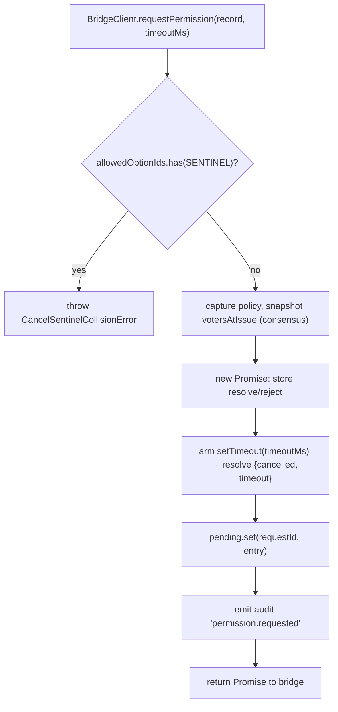
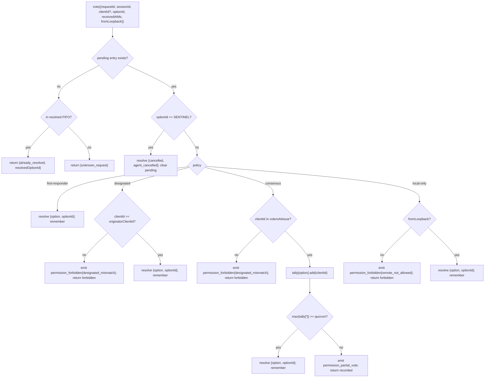

# 多客户端权限协调
## 概览

ACP 子进程的 agent 调 `requestPermission` 时，daemon 并不会只转给某一个客户端 —— `sessionScope: 'single'` 下每个连上来的客户端都看得到这个请求，谁回复都行。没有协调器就乱套：迟到的投票无处去、两个客户端 race 同一个请求、一个流氓客户端能盖过 originator 等等。

`MultiClientPermissionMediator`（`packages/acp-bridge/src/permissionMediator.ts:1-1292`）实现了 `PermissionMediator` 契约（`packages/acp-bridge/src/permission.ts`），bridge 的所有 pending + resolved 权限状态都归它管。它按 `PermissionPolicy` 四选一分派投票：

| 策略              | 裁决规则                                                                                         | 用例                                     |
| ----------------- | ------------------------------------------------------------------------------------------------ | ---------------------------------------- |
| `first-responder` | 第一个有效票获胜；后来的拿 `permission_already_resolved`                                         | 实时跨客户端协作 UX（默认）              |
| `designated`      | 只允许 prompt 的 `originatorClientId` 裁决；其他人收 `permission_forbidden{designated_mismatch}` | per-tenant SaaS，UI surface 自己拥有审批 |
| `consensus`       | N-of-M 法定人数（pair-token 认证），过程中 `permission_partial_vote` 让 UI 渲进度                | 企业变更评审，两名操作员需达成一致       |
| `local-only`      | 拒绝任何非 loopback 投票，阻塞直到 loopback 客户端裁决                                           | 工作站，远程控制绝不能授予提权           |

## 职责

- 跟踪每个 pending 请求（`request → vote → resolved` 生命周期）。
- 给每个请求装上 wallclock 超时（**N1 不变式**：超时必须在 `request()` **同步**装上，不然立刻 cancel 的 session 会把闭包永远 pending 漏掉）。
- 按 `request()` 时刻捕获的策略派发投票（中途改 daemon 全局策略不影响飞行中请求）。
- 维护有界 FIFO（`MAX_RESOLVED_PERMISSION_RECORDS = 512`），新近 resolved 的请求重复投票拿结构化 `already_resolved` 而不是 `unknown_request`。
- 在 per-session EventBus 上发 `permission_partial_vote`（consensus）和 `permission_forbidden`（designated / consensus / local-only）。
- 在 session teardown 时 `forgetSession(sessionId)` 把 pending 解析为 `{kind: 'cancelled', reason: 'session_closed'}`。
- 拒绝恶意 / 误注入 `CANCEL_VOTE_SENTINEL`：wire 端 `InvalidPermissionOptionError`，agent 端 `CancelSentinelCollisionError`。

## 架构

### 公开 surface

```ts
interface PermissionMediator {
  readonly policy: PermissionPolicy;
  request(
    record: PermissionRequestRecord,
    timeoutMs: number,
  ): Promise<PermissionResolution>;
  vote(vote: PermissionVote): PermissionVoteOutcome;
  forgetSession(sessionId: string): void;
}
```

`MultiClientPermissionMediator` 还有 `peekSessionFor(requestId)`、`pendingCount(sessionId)`、内部 audit publisher 等。`BridgeClient` 只依赖 `request()` 那一半（结构化 sub-typing，见 `bridgeClient.ts:30`）。

### `PermissionPolicy` 与 `PermissionVoteOutcome`

```ts
type PermissionPolicy =
  | 'first-responder'
  | 'designated'
  | 'consensus'
  | 'local-only';

type PermissionVoteOutcome =
  | { kind: 'resolved'; resolvedOptionId: string }
  | { kind: 'recorded'; votesNeeded: number } // consensus 局部
  | { kind: 'already_resolved'; resolvedOptionId: string }
  | { kind: 'forbidden'; reason: 'designated_mismatch' | 'remote_not_allowed' }
  | { kind: 'unknown_request' };

type PermissionResolution =
  | { kind: 'option'; optionId: string }
  | {
      kind: 'cancelled';
      reason: 'timeout' | 'session_closed' | 'agent_cancelled';
    };
```

### Cancel 哨兵

`CANCEL_VOTE_SENTINEL = '__cancelled__'`。bridge 把 voter `{outcome:'cancelled'}` 映射成这个哨兵后再调 `mediator.vote`。mediator 在策略派发**之前**就处理哨兵 —— voter-cancel 在任何策略下都能用，跟 `clientId` / loopback / membership 无关。两道护栏：

1. **`bridge.ts`** 拒掉 wire 端 `optionId === CANCEL_VOTE_SENTINEL` 的投票，抛 `InvalidPermissionOptionError`（恶意 wire 客户端不能靠假报 `optionId` 注入 cancel）。
2. **`mediator.request`** 拒掉 `allowedOptionIds` 包含哨兵的记录，抛 `CancelSentinelCollisionError`（agent 合法发布 `'__cancelled__'` 选项标签也不能伪装成 cancel）。

这种刻意跨策略 escape 在 `permissionMediator.ts:50-57` 有文档说明，免得未来 maintainer 把它「修掉」。

### Pending 状态

每个 pending 按 `requestId` 索引，包含：

- `policy` —— `request()` 时捕获。
- `record: PermissionRequestRecord`（requestId、sessionId、originatorClientId、allowedOptionIds、issuedAtMs）。
- `resolve` / `reject` 闭包。
- `votesAtIssue`（仅 consensus）—— 发起时 session 上已登记的 `clientIds` 快照；后到的投票必须在这个集合里。
- `tally`（仅 consensus）—— `Map<optionId, Set<clientId>>` 按 option 计票。
- `timeoutHandle` —— `request()` 内同步装上的 Node timeout（N1 不变式）。
- `auditTrail[]` —— 每票审计记录。

### Resolved FIFO

`MAX_RESOLVED_PERMISSION_RECORDS = 512`，FIFO 通过 `resolvedOrder.shift()`（DeepSeek review #4335 / 3271627446，对齐 `PermissionAuditRing`）。只存 `{requestId, sessionId, outcome}`，512 条在正常 UI 重连 / race 窗口下 < 100 KB。

## 流程

### `request()`（N1 不变式）



定时器在 entry 对外可见**之前**就装上。否则 `forgetSession` 在 `pending.set` 与 `setTimeout` 之间到来，entry 就成了「pending 但无超时」 —— bridge 的 per-session `promptQueue` 永远 hang。

### `vote()` 派发



### `forgetSession()`

session close / 剔除 / bridge shutdown 时调用。对每个 `record.sessionId === sessionId` 的 pending entry：

1. 取消超时。
2. 用 `{kind: 'cancelled', reason: 'session_closed'}` resolve Promise。
3. 写一条 audit。
4. 从 `pending` 删除。

bridge 的 session-teardown 路径永远在 channel-kill 窗口**之前**调 `forgetSession`，pending 不会比 session 活得久。

## 状态与生命周期

- `policy` per-request 捕获。改 daemon 全局策略不影响飞行中请求。
- `votesAtIssue`（consensus）`request()` 时捕获；request 后到来的客户端可以投票，但 `clientId` 不在那时的快照中 → 拒为 `designated_mismatch`。和 `designated` 的 mismatch 原因刻意重载以保持契约封闭；未来版本如果 SDK 需要区分可以拆。
- Resolved entry 在 FIFO 里活最多 `MAX_RESOLVED_PERMISSION_RECORDS`（512）；evict 后对同 `requestId` 的重复投票返回 `{unknown_request}`。
- `permission_partial_vote` 只在 `consensus` 下发，别人那不要依赖。
- `permission_forbidden` 在 `designated` / `consensus` / `local-only` 下发，**不在** `first-responder` 下发。

## 依赖

- [`03-acp-bridge.md`](./03-acp-bridge.md) — bridge 怎么把 `BridgeClient.requestPermission` 接到 `mediator.request`。
- [`10-event-bus.md`](./10-event-bus.md) — partial-vote / forbidden 帧怎么到客户端。
- [`09-event-schema.md`](./09-event-schema.md) — `permission_*` 事件的 payload 契约。
- [`08-session-lifecycle.md`](./08-session-lifecycle.md) — 每次 session 终态都会 `forgetSession()`。
- [`02-serve-runtime.md`](./02-serve-runtime.md) — `PermissionAuditRing`（512 条 FIFO 审计）。

## 配置

| 来源            | 旋钮                                                                                                | 效果                 |
| --------------- | --------------------------------------------------------------------------------------------------- | -------------------- |
| `settings.json` | `policy.permissionStrategy`                                                                         | 激活 mediator 策略   |
| `settings.json` | `policy.consensusQuorum`                                                                            | consensus 的 N       |
| `BridgeOptions` | `permissionPolicy`、`permissionConsensusQuorum`、`permissionAudit`                                  | 程序化覆盖           |
| 能力 tag        | `permission_mediation`（恒；`modes: ['first-responder', 'designated', 'consensus', 'local-only']`） | 构建期支持集         |
| 能力 envelope   | `policy.permission`                                                                                 | 当前 daemon 跑的策略 |

## Consensus 法定人数：默认公式与 M=2 边界

`consensus` 策略激活且 `policy.consensusQuorum` 没显式配置时，mediator 按 **N = floor(M/2) + 1** 算 quorum（`permissionMediator.ts:1030`，`Math.max(1, Math.floor(m / 2) + 1)`）。具体：

| M（`votersAtIssue.size`） | 默认 N | 行为                                       |
| ------------------------- | ------ | ------------------------------------------ |
| 1                         | 1      | 单投票者立即裁决                           |
| 2                         | 2      | **要求一致同意**，两个客户端必须选同一选项 |
| 3                         | 2      | 多数                                       |
| 4                         | 3      | 超过半数                                   |
| 5                         | 3      | 多数                                       |
| 6                         | 4      | 超过半数                                   |

**M = 2** 时分票（A 选 X，B 选 Y）**只能靠 per-permission 超时**裁决 —— 哪个选项都到不了一致同意，请求挂到 `permissionResponseTimeoutMs`（默认 5 min）触发，解析为 `{cancelled, timeout}`。mediator 在 `permissionMediator.ts:486-495` 打 stderr 提示这层「一致同意 → 分票走超时」语义，operator 在日志里能看到。

operator 想要 M = 2 时严格多数（不要一致同意）可以显式 `policy.consensusQuorum: 1`，行为塌陷为「第一票即胜」。更宽松配置（比如 M = 4 也强制一致）也通过同字段调。

## Boot 时策略校验

`runQwenServe.validatePolicyConfig(policyConfig)`（`packages/cli/src/serve/runQwenServe.ts:89+`）在 boot 时解析合并后的 settings `policy.*` 段，operator 配错时抛 `InvalidPolicyConfigError`：

- `policy.permissionStrategy` 设了但不在四值集合内。合法集合**运行时派生**自 `SERVE_CAPABILITY_REGISTRY.permission_mediation.modes`（单一事实源，将来加第五种策略时校验器和能力广播一起更新）。
- `policy.consensusQuorum` 设了但不是正整数。

外加一条**软警告**（stderr）：`consensusQuorum` 设了但 `permissionStrategy !== 'consensus'` —— override 在非 consensus 策略下会被静默丢掉，警告浮出来，operator 不会以为它生效。

`InvalidPolicyConfigError` 导出供测试 `instanceof`；`runQwenServe` 的 boot catch 用它区分 operator 错配（rethrow → 显式 boot 失败）和 settings 读 I/O 失败（fallback 默认）。

## 安全注意：v1 的 client 身份是自报

`X-Qwen-Client-Id` 由 HTTP 客户端**自报**，daemon 在 v1 **不做** proof-of-possession 检查。daemon 校验格式（`[A-Za-z0-9._:-]{1,128}`），按 session 跟踪 attach 的 client id 进 `clientIds`，但任何客户端只要观察到 SSE 帧里的 `originatorClientId`，就能用同 id 注册并在后续请求里冒充 originator。

每个策略的影响：

- **`first-responder`** —— 不受影响，策略不依赖身份。
- **`designated`** —— 远端客户端可以伪装 `originatorClientId`，对本应只让 prompt 发起人投票的请求投票。**`settings.json` 的 `policy.permissionStrategy` 描述里有显式标注。**
- **`consensus`** —— 投票按 issue-time `votersAtIssue` 快照闸；快照里如果已经有伪装 id（冒充者在 request 时就 attach 了），它就能投。
- **`local-only`** —— `fromLoopback: boolean` 由 daemon 按连接的 remote address 盖戳，**不**取自客户端，所以这个策略对 id 伪装免疫，闸是按连接而非按 id。

「pair-token」机制（daemon 在 `POST /session` 发一个 per-session secret，`designated` / `consensus` 投票时必须带）将来 PR 落地，v1 没有。今天想加固 designated 策略的部署应当绑 loopback（`local-only` 天然 robust），或挂在做认证的反代后面。

## 注意 & 已知局限

- **Cancel 哨兵在策略派发之前路由**是刻意的 —— `local-only` 和 `consensus` 都能被任何投 `{outcome: 'cancelled'}` 的客户端取消。这是 agent 侧 abort 路径，文档在 `permissionMediator.ts:50-57`。**`local-only` 特别注意**：远端客户端**不能 RESOLVE**，但**能 ABORT** pending permission。F3 v1 把 cancel 跨策略统一是出于一致性考虑。需要严格 cancel-too（远端调用方完全不能影响 pending）的部署必须跑专用 loopback-bound daemon —— 当下没有 per-policy cancel 闸。
- **`designated` 与 `consensus` 都用 `designated_mismatch`** 在 `PermissionVoteOutcome` 里重载；mediator 写不同 audit，但 wire 形状一致。未来协议版本可能拆。
- **匿名投票者（无 `X-Qwen-Client-Id`）** 只在 `first-responder` 和 `local-only`（loopback）下被接受；`designated` / `consensus` 拒。
- **跨策略 escape** 意味着 cancel 无法被策略 gate。如果部署需要 policy-gated cancel，那是未来契约变化，不要用路由级 check paper-over。
- **`votesAtIssue` 快照语义**意味着客户端集合在变动中的 consensus 部署会拒掉合法客户端（连入晚于 request 发起）。operator 应当在发起 change-review prompt 之前预先注册协作者的 client id。

## 参考

- `packages/acp-bridge/src/permission.ts:1-177`（冻结契约）
- `packages/acp-bridge/src/permissionMediator.ts:1-1292`（实现，F3 commit 6+7）
- `packages/acp-bridge/src/bridgeClient.ts:30`（对 `PermissionMediator` 用结构化 sub-typing）
- `packages/acp-bridge/src/bridgeErrors.ts`（`CancelSentinelCollisionError`、`InvalidPermissionOptionError`、`PermissionForbiddenError`）
- `packages/cli/src/serve/permissionAudit.ts:1-60`（audit ring + publisher）
- Issue：[#4175](https://github.com/QwenLM/qwen-code/issues/4175) F3 系列。
