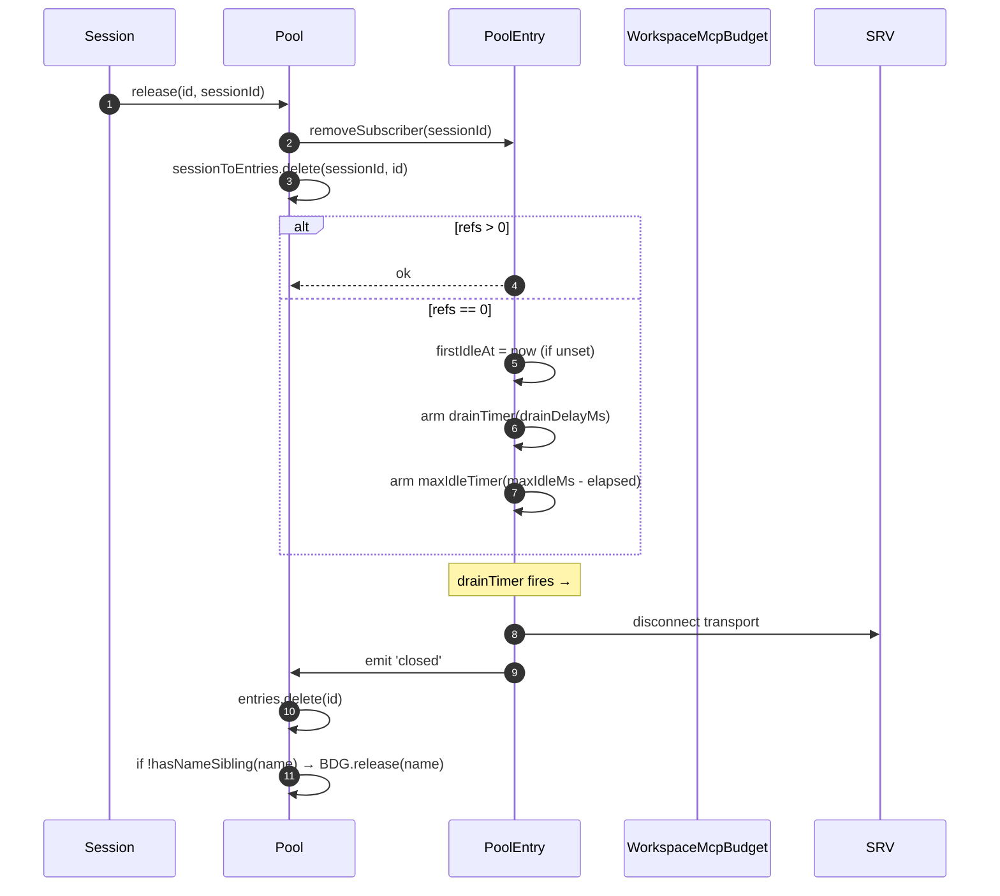
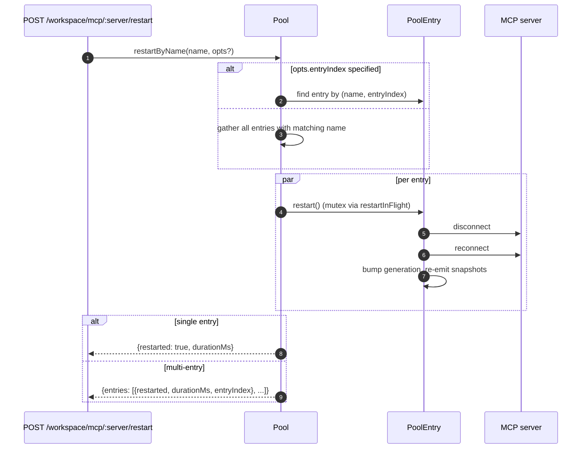
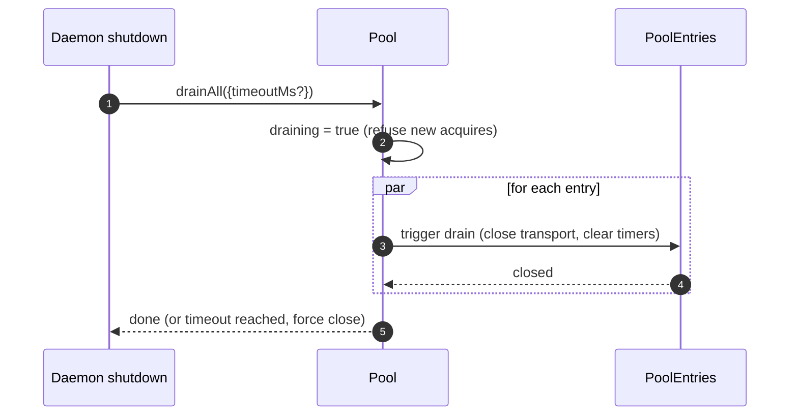

# Workspace MCP Transport 池
## 概览

`McpTransportPool`（`packages/core/src/tools/mcp-transport-pool.ts:104+`）是 F2（#4175 commit 5）的工作区级共享池：一个 daemon 上的 N 个 ACP session 共享每个唯一 `(serverName + configFingerprint)` 元组对应的一条 transport，不再各 spawn 一份 MCP 子进程。池**在 ACP 子进程里**（`QwenAgent.mcpPool`），用 daemon bootstrap `Config` 构造一次，活过 session 生命周期 —— 条目按 session attach 引用计数，refs 归零后在可配宽限期 drain 回 closed。

它是多 session daemon 不至于把每个 MCP server fork N 份的最大原因。

## 职责

- 每 `(name + fingerprint)` acquire 或 spawn 一条 transport，并发 cold acquire 通过 `spawnInFlight` 去重。
- 释放 per-session 引用；最后一个引用脱离时 arm drain 定时器。
- 用硬性 `MAX_IDLE_MS` 上限挡住 ref-count 抖动客户端无限保活。
- 用反向索引 `sessionToEntries` 让 `releaseSession(sessionId)` 是 O(refs) 而不是 O(entries)。
- 按需重启条目（`restartByName`）：单条目返回 `{restarted, durationMs}`，多条目返回 `{entries: RestartResult[]}`（F2 multi-entry 契约）。
- daemon shutdown 时 `drainAll` 用可配置超时排空全池；drain 期间拒绝新 acquire。
- 与 `WorkspaceMcpBudget`（见 [`06-mcp-budget-guardrays.md`](./06-mcp-budget-guardrails.md)）联动在 `acquire` 上做 per-name 预留上限；条目 close 且同名无其他 entry 时释放 slot。
- 通过 `SessionMcpView` 给每 session 一个过滤过的 tool / prompt 快照，免得一个 session 的 discovery 把 tool 注册到其他 session。

## 架构

### 公开 surface

```ts
class McpTransportPool {
  constructor(cliConfig: Config, options: McpTransportPoolOptions);
  acquire(
    serverName,
    cfg,
    sessionId,
    sessionToolRegistry,
    sessionPromptRegistry,
  ): Promise<PooledConnection>;
  release(id, sessionId): void;
  releaseSession(sessionId): void;
  restartByName(
    name,
    opts?,
  ): Promise<RestartResult | { entries: RestartResult[] }>;
  drainAll(opts?): Promise<void>;
  getBudget(): WorkspaceMcpBudget | undefined;
  getSnapshot(): McpPoolSnapshot;
}
```

`McpTransportPoolOptions`：

- `workspaceContext: WorkspaceContext`（必填）。
- `debugMode: boolean`。
- `sendSdkMcpMessage?` —— per-session 回调（池绕过 SDK MCP）。
- `pooledTransports?: ReadonlySet<McpTransportKind>` —— 默认 `{stdio, websocket}`。HTTP/SSE 故意不入池（header 可能带 session 特定 OAuth state，入池会跨 session 泄漏凭证）。
- `drainDelayMs?` —— 默认 `30_000`。
- `entryOptions?: (transport) => PoolEntryOptions`。
- `budget?: WorkspaceMcpBudget`。

### 内部状态

| 状态               | 类型                                    | 用途                                                                     |
| ------------------ | --------------------------------------- | ------------------------------------------------------------------------ |
| `entries`          | `Map<ConnectionId, PoolEntry>`          | live 条目，key 为 `connectionIdOf(name, fingerprint)`                    |
| `unpooledIds`      | `Set<ConnectionId>`                     | HTTP/SSE 那种非可入池 transport 的条目                                   |
| `spawnInFlight`    | `Map<ConnectionId, Promise<PoolEntry>>` | 并发 cold acquire 去重                                                   |
| `sessionToEntries` | `Map<string, Set<ConnectionId>>`        | V21-2 反向索引，让 `releaseSession` 是 O(refs)                           |
| `draining`         | `boolean`                               | Wenshao C5 drain 锁；一旦置位所有 `acquire` 都拒                         |
| `nextIndexByName`  | `Map<string, number>`                   | V21-7 per server 单调 `entryIndex`（dashboard 不会因为新条目出现而抖动） |

### `PoolEntry`（每条目结构体，`mcp-pool-entry.ts`）

状态机：`spawning → active ⇄ (active ↔ reconnect) → (active → draining on last detach, draining → active on attach OR draining → closed on timer)`。

| 字段                                                   | 用途                                                          |
| ------------------------------------------------------ | ------------------------------------------------------------- |
| `localStatus: MCPServerStatus`                         | 由 `MCPServerStatus` 生命周期驱动                             |
| `state: PoolEntryState`                                | `spawning`/`active`/`draining`/`closed`/`failed`              |
| `generation: number`                                   | 每次 restart bump，订阅者比较探测 reconnect 周期              |
| `refs: Set<string>`                                    | 当前 attach 的 session id 集合                                |
| `subscribers: Map<string, SessionMcpView>`             | per-session 过滤视图                                          |
| `subscriberHandles: Map<string, PooledConnectionImpl>` | `acquire` 返回的 handle                                       |
| `toolsSnapshot[]`、`promptsSnapshot[]`                 | 池级 canonical 快照；`toolsChanged` / `promptsChanged` 时重发 |
| `drainTimer?`                                          | `refs.size === 0` 时装上，默认 30s；attach 时重置             |
| `maxIdleTimer?`                                        | **首次** idle 时装上，acquire/release 抖动不重置；默认 5 min  |
| `firstIdleAt?`                                         | 硬性最大空闲的水位线                                          |
| `restartInFlight?`                                     | `restart()` 的互斥                                            |

### `PoolEntryOptions`

```ts
interface PoolEntryOptions {
  drainDelayMs: number; // 默认 30_000
  maxIdleMs: number; // 默认 5 * 60_000
  maxReconnectAttempts: number; // 默认 3（stdio/ws）或 5（http/sse）
  reconnectStrategy:
    | { kind: 'fixed'; delayMs: number }
    | { kind: 'exponential'; baseMs: number; capMs: number };
}
```

`defaultPoolEntryOptions(transport)`（`mcp-pool-entry.ts:58-70`）：stdio/ws → `{fixed 5s, 3 次}`；http/sse → `{exponential 1s → 16s, 5 次}`。remote transport 给更长重试预算，因为它们的失败更多是 transient。

## 流程

### `acquire`

```mermaid
sequenceDiagram
    autonumber
    participant S as Session
    participant P as Pool
    participant SIF as spawnInFlight
    participant E as PoolEntry
    participant BDG as WorkspaceMcpBudget
    participant SRV as MCP server

    S->>P: acquire(name, cfg, sessionId, sessionToolRegistry, sessionPromptRegistry)
    P->>P: refuse if draining
    P->>P: connectionId = connectionIdOf(name, fingerprint)
    P->>P: if !isPoolable(cfg) → mark unpooled
    alt entry in entries (warm)
        E-->>P: existing PoolEntry
    else inflight cold spawn
        SIF-->>P: existing Promise<PoolEntry>
    else cold start
        P->>BDG: tryReserve(name) (if budget set + poolable)
        BDG-->>P: 'reserved' | 'already_held' | 'refused'
        alt refused
            P->>BDG: recordRefusal(name, transport)
            P-->>S: BudgetExhaustedError
        else ok
            P->>E: spawnEntry(name, cfg)
            E->>SRV: connect transport
            SRV-->>E: ready
            P->>P: entries.set(id, E); nextIndexByName++
            E-->>P: connected
        end
    end
    P->>E: addSubscriber(sessionId, sessionToolRegistry, sessionPromptRegistry)
    P->>P: sessionToEntries.add(sessionId, id)
    P->>P: cancel drain timer (refs>0)
    P-->>S: PooledConnection { id, serverName, entryIndex, client, toolsSnapshot, promptsSnapshot, on, off, release }
```

### `release` + drain



`hasNameSibling(name)`（`mcp-transport-pool.ts:181+`）同时遍历 `entries.values()` 和 `spawnInFlight.keys()`；后者要用 `parseConnectionId` 解析（MCP server 名可以合法包含 `::`，`startsWith` 会在 sibling 名以 `${name}::` 开头时假阳性）。

`releaseSession(sessionId)` 从 `sessionToEntries` 读，O(refs) 释放该 session 引用的所有条目然后清索引。bridge 的 session-close 路径用它，不必遍历整个 entry map。

### `restartByName`



daemon HTTP 层的预检（Wave-4 PR 17）：目标 slot 没有被预留，且重启会让 live count 超 `enforce` 预算时，返回 `{restarted:false, skipped:true, reason:'budget_would_exceed'}`。

### `drainAll`



## 状态与生命周期

- 池构造同步；首次 `acquire` 冷启动 transport。
- `drainDelayMs`（默认 30s）attach 时取消。
- `maxIdleMs`（默认 5 min）attach/detach 抖动**不**重置；从**首次** idle 起跳，到点或在 deadline 前 attach 才停。挡 thrashing 客户端。
- `nextIndexByName` 单调。新条目出现后老条目保留原 index，dashboard 读 `entryIndex` 不抖。
- Spawn 失败释放预留的 budget slot（V21-4，否则 cold spawn 在 connect 中途崩会永远漏 reservation）。

## 依赖

- `packages/core/src/tools/mcp-client.ts`：`McpClient`、status 枚举、`SendSdkMcpMessage`。
- `packages/core/src/tools/mcp-pool-entry.ts`：`PoolEntry`、`PoolEntryOptions`、`defaultPoolEntryOptions`。
- `packages/core/src/tools/mcp-pool-key.ts`：`connectionIdOf`、`parseConnectionId`、`isPoolable`、`mcpTransportOf`、`POOLED_TRANSPORTS_DEFAULT`。
- `packages/core/src/tools/mcp-pool-events.ts`：`ConnectionId`、`PoolEntryState`、`PoolEvent`。
- `packages/core/src/tools/session-mcp-view.ts`：per-session 过滤视图。
- `packages/core/src/tools/mcp-workspace-budget.ts`：`WorkspaceMcpBudget`（见 [`06-mcp-budget-guardrails.md`](./06-mcp-budget-guardrails.md)）。
- `packages/core/src/tools/mcp-discovery-timeout.ts`：`discoveryTimeoutFor`、`runWithTimeout`。

## 配置

| 来源             | 旋钮                                                            | 效果                                                                                               |
| ---------------- | --------------------------------------------------------------- | -------------------------------------------------------------------------------------------------- |
| Env              | `QWEN_SERVE_NO_MCP_POOL=1`                                      | 杀手锏 —— `QwenAgent.mcpPool` 保持 undefined，回退到 per-session `McpClientManager`（pre-F2 路径） |
| 参数             | `--mcp-client-budget=N`、`--mcp-budget-mode={off,warn,enforce}` | 通过 `childEnvOverrides` 传 ACP 子进程；子进程构造 `WorkspaceMcpBudget` 喂给池                     |
| 能力 tag（条件） | `mcp_workspace_pool`、`mcp_pool_restart`                        | 池开启时一起广播。SDK 都 pre-flight 才能依赖 pool-aware 响应形状                                   |

### 非入池条目（HTTP / SSE / SDK-MCP）

`pooledTransports` 之外的 transport（HTTP、SSE、SDK-MCP）走另一条路：`createUnpooledConnection(name, cfg, sessionId, ...)`（`mcp-transport-pool.ts:855+`）按 session 起一条 entry，id 形如 `${name}::unpooled-${entryIndex}`。与入池条目的差异：

- 同时存到 `entries` 和 `unpooledIds: Set<ConnectionId>`，`release` / `releaseSession` 能快速走 detach-即关 的路径（refs 永远最多 1）。
- 直接调 `McpClient.discover()`，不走池的重放；`applyTools` / `applyPrompts` 都是 no-op，因为 session 的 registry 自己已经持有刚注册的内容（W77 / `attach()` 里 `skipReplay: true`）。
- workspace 预算照样闸 —— F2 commit 6 关掉了之前 unpooled 绕过 `tryReserve` 的口子；不管入不入池，同一个 `WorkspaceMcpBudget` slot 都被预留，entry close 时释放。

W77 竞态（`cb206da36`）：`createUnpooledConnection` 在 await `client.connect()` / `client.discover()` 之前就把 entry 放进 `this.entries`，但只在 `attach()` 成功之后才往 `sessionToEntries[sessionId]` 索引。connect/discover 窗口里并发到来的 `closeStoredSession()` / `releaseSession(sessionId)` 看到空索引，让 unpooled spawn 跑完，`attach()` 接着把 tool/prompt 注册到一个已经关闭的 session。修复：

- `mcp-pool-entry.ts:251`：公开 `isTerminated(): boolean` 探针（`state === 'closed' || state === 'failed'`）。
- `mcp-pool-entry.ts:260`：`markActive()` 在 `isTerminated()` 时短路，已拆掉的 entry 不能被复活到 `'active'`。
- 调用方（池的 unpooled 路径）在 await 之间探 `isTerminated()`，父 session 没了就放弃 attach。

这条 race 今天**潜在**（W61/W71 的 per-session `releaseSession` hook 在 F4 才落），但那个 hook 一到这条 race 就变 live —— F2 线上先把它修了。

## `GET /workspace/mcp` 的 pool-aware 快照字段

池激活时，`ServeWorkspaceMcpStatus` 每个 server cell（`packages/acp-bridge/src/status.ts:155+`）在 F2 之前的形状之外多两个字段：

| 字段             | 类型                                        | 用途                                                                                                                                                                                                                                                                                                               |
| ---------------- | ------------------------------------------- | ------------------------------------------------------------------------------------------------------------------------------------------------------------------------------------------------------------------------------------------------------------------------------------------------------------------ |
| `disabledReason` | `'config' \| 'budget'`                      | 区分 operator 禁用（`disabled: true` 来自 `disabledMcpServers` 配置）和 PR 14 预算拒绝（`status: 'error', errorKind: 'budget_exhausted'`）。operator 在 dashboard 上不必交叉查 `errors[]` 或 `budgets[]` 才能渲染单 server 行                                                                                      |
| `entryCount`     | `number`（≥1）                              | 池模式工作区上同名可有多条 `PoolEntry`（session 注入不同 fingerprint，如 per-session OAuth header）。pre-F2 daemon 和 `QWEN_SERVE_NO_MCP_POOL=1` 的 F2 daemon 上不存在。新客户端按 `entryCount > 1` 渲「N 条 entry」徽章                                                                                           |
| `entrySummary`   | `ReadonlyArray<{entryIndex, refs, status}>` | per-entry 分解。`entryIndex` 是 entry 创建时分配的**稳定不透明整数**（V21-7）—— **不是**原始 fingerprint，否则会通过快照 diff 泄漏 OAuth/env 轮换时机。`refs` 是当前 attach 的 session 数。`status` 是 per-entry 运行时状态，dashboard 在聚合 `mcpStatus` 已经 `connected` 但某条 entry 还在重连时仍能显示分项健康 |

`(entryCount, entrySummary)` 这一对**广播时永远成对**出现 —— `mcp_workspace_pool` 能力 tag 蕴含两者。老 SDK 客户端按加法协议契约忽略它们。

## IDE 关闭路径也 drain 池（`acpAgent.ts:320`）

池 drain **不**仅在 SIGTERM handler 里跑 —— IDE 发起的正常关闭路径（`await connection.closed`）也触发 `drainAll`。修复前（review fold-in C1），IDE 干净关连接时 entry 一直泄漏直到 OS 回收。现在 shutdown-handler 路径和 `connection.closed` 路径互为镜像（`packages/cli/src/acp-integration/acpAgent.ts:247-320`）。

## `/mcp refresh` 也走池（`discoverAllMcpToolsIncremental`）

`discoverAllMcpTools`（boot 期发现）和 `discoverAllMcpToolsIncremental`（`/mcp refresh` / 热加载）在池模式下都先查池。Review fold-in C7 关掉了池模式 gate 只加到 `discoverAllMcpTools` 的口子 —— `/mcp refresh` 绕过池起 per-session client，把 budget 算两次还留下孤儿 transport。两条 discovery 路径现在一致（`packages/core/src/tools/mcp-client-manager.ts:1960+`）。

## 重连期间 in-flight 工具调用（`MCPCallInterruptedError`）

底层 MCP transport 静默掉线（"silent transport drop"：连接从 `'active'` / `'draining'` 直接进 `localStatus === DISCONNECTED`，没有显式关闭）时，池把 entry 转 `'failed'`、从 `pool.entries` 驱逐、在 detach 订阅者视图**之前**先 emit `failed` 事件（`mcp-pool-entry.ts:335-360`）。emit-先于-detach 的顺序重要：订阅者及时收到 `failed` 事件，能把 pending `callTool` promise 路由到 `MCPCallInterruptedError`，卡住的 `await client.callTool(...)` 干净 reject 而不是 hang。

这是 F2 commit-6 review fix W122 R20-followup + R23 T15 ordering fix。镜像点是 `forceShutdown` 的 emit→detach 顺序，`mcp-pool-entry.ts:583-593`。

## Fingerprint 与 `canonicalOAuth` 归一

池 key 由 `fingerprint(cfg)`（`mcp-pool-key.ts:128+`）计算。哈希字段覆盖所有 transport 定义性的：

> `transport, command, args, cwd, env, url, httpUrl, tcp, headers, timeout, oauth`

per-session 过滤 / 元数据字段（`includeTools`、`excludeTools`、`trust`、`description`、`extensionName`、`discoveryTimeoutMs`）**被排除**，不同 session 用不同过滤共享同一 entry。

OAuth 这一格，`canonicalOAuth(o)`（`mcp-pool-key.ts:75-110`）哈希**每一个** `MCPOAuthConfig` 字段 —— `clientId`、`clientSecret`、`scopes`（排序后）、`audiences`（排序后）、`authorizationUrl`、`tokenUrl`、`redirectUri`、`tokenParamName`、`registrationUrl`。修复前只哈希 `clientId` / `scopes` / `authorizationUrl` / `tokenUrl` —— 两个 session 的 config 仅在 `clientSecret` 或 `audiences` 上有差也会塌缩到同 fingerprint 共享一条 entry，把第一个 config 的凭证泄漏给第二个 session 的 transport。**对 `clientSecret`（confidential client）和 `audiences`（multi-audience token）尤其关键。** 由 qwen-latest W88（F2 commit-6 review）关闭。

scope 数组和 audience 数组排序，callsite 顺序不会改 fingerprint；显式 `null` 默认让 undefined 字段哈希等于显式 null。key 里没有 `discoveryTimeoutMs` —— F2 v1 承认同 key 不同 timeout 并发 acquire 是「first wins」（对齐 pre-F2 per-session manager 行为）。

## Extension 卸载：孤儿 entry 由 MAX_IDLE_MS 自然回收

F2 v2.1 设计（V21-13）选择**不**为运行中卸载 MCP extension 加主动回收。孤儿 entry（extension 的 `MCPServerConfig` 已不在工作区合并设置里但池里还有 entry）由最后一个订阅者 detach 后的 `MAX_IDLE_MS`（默认 5 min）硬上限自然回收。原因：同步的卸载-回收路径为 operator 罕见的边缘场景加复杂度，硬上限把孤儿进程超过卸载点的最坏寿命限到 5 分钟。

operator 想要更快的孤儿清理可以重启 daemon 或对已不再配置的 name 触发 `POST /workspace/mcp/:server/restart` —— 会走 disabled-server 路径把 entry 拆掉。

## 注意 & 已知局限

- **HTTP / SSE transport 不入池** —— 每次 acquire 新起一条只活 session 那么久。原因：header 可能带 session 特定 OAuth state，入池会跨 session 泄漏凭证。
- **`maxIdleMs` 是抗抖动硬上限**。5 分钟硬空闲意味着即使激进 attach/detach 也不能让 idle transport 钉超 5 分钟。想要长期常驻 transport 的 operator 应该调大 `maxIdleMs` 或者把 server 跑在池外面。
- **per-server-name 预算 slot** 意味着同名不同 fingerprint 的两条入池条目共占 ONE slot 而不是两个。子进程账面分开通过 `pool.getSnapshot().subprocessCount` 暴露。
- **`startsWith` 回归** 在 `hasNameSibling` 里被规避，因为 MCP server 名可以合法含 `::`（`mcp-pool-key.test.ts:258`）；永远用 `parseConnectionId` 的 `lastIndexOf('::')` 切，不要用字符串前缀匹配。
- **池 drain 是单向**：`drainAll` 永久置 `draining = true`；要再 work 必须新池。

## 参考

- `packages/core/src/tools/mcp-transport-pool.ts`（整文件；关键行 104+、181+、208+）
- `packages/core/src/tools/mcp-pool-entry.ts:1-120+`（entry 生命周期）
- `packages/core/src/tools/mcp-pool-key.ts`（`connectionIdOf`、`parseConnectionId`）
- `packages/core/src/tools/mcp-pool-events.ts`（事件类型）
- `packages/core/src/tools/session-mcp-view.ts`（per-session 过滤视图）
- F2 设计文档（v2.2，含 32 条 review fold-in）：[`../../design/f2-mcp-transport-pool.md`](../../design/f2-mcp-transport-pool.md)。实现契约的事实源；本篇是它的开发者深度阅读。
- F2 设计笔记：issue [#4175](https://github.com/QwenLM/qwen-code/issues/4175)（F2 系列 commit 4-6）。
