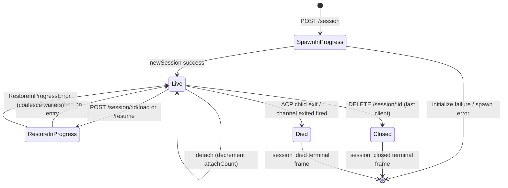

# Session 生命周期与身份
## 概览

daemon **session** 是一段绑定到一个 ACP `sessionId` 的逻辑对话。bridge 为每个 session 维护一个 `SessionEntry`（见 [`03-acp-bridge.md`](./03-acp-bridge.md)），把 ACP child connection 与 HTTP 侧的簿记捆在一起：prompt FIFO、model-change FIFO、event bus、pending permission、attach 的客户端、心跳、restore 状态、终态 tombstone。

daemon **客户端**由 `X-Qwen-Client-Id` 标识 —— 一段不透明、由 daemon 校验的字符串，调用方自行在请求里盖。daemon 自己不会替调用方生成 id；客户端自取并复用，daemon 据此归属投票、审计事件、识别重连。

本文讲清每一次 session 状态迁移（create / attach / load / resume / close / die / evict）以及 daemon 暴露的每个身份相关 surface。

## 职责

- 创建、attach、restore、回收 session。
- 校验 `X-Qwen-Client-Id`，错的格式直接拒。
- 跟踪 session 上多个 attach 的客户端（`clientIds: Map<string, count>`、`attachCount`）。
- 给出站事件盖 `originatorClientId`。
- 跑心跳，让 dashboard 知道谁还在连着。
- 提供 `displayName`，operator 通过 `PATCH /session/:id/metadata` 设置。
- 推送终态帧（`session_died`、`session_closed`、`client_evicted`、`stream_error`）。

## 架构

| 关注点                    | 源                                                          | 说明                                                                             |
| ------------------------- | ----------------------------------------------------------- | -------------------------------------------------------------------------------- |
| `SessionEntry`            | `packages/acp-bridge/src/bridge.ts:183-285`                 | 每 session 结构体，字段列表见 [`03-acp-bridge.md`](./03-acp-bridge.md)           |
| `BridgeSession`（对外）   | `packages/acp-bridge/src/bridgeTypes.ts:49+`                | `{ sessionId, workspaceCwd, attached, clientId?, createdAt? }` 回给 HTTP handler |
| `BridgeSessionState`      | `packages/acp-bridge/src/bridgeTypes.ts:73+`                | `LoadSessionResponse \| ResumeSessionResponse`，缓存为 `restoreState`            |
| `DaemonSession`（SDK）    | `packages/sdk-typescript/src/daemon/types.ts:113`           | `{ sessionId, workspaceCwd, attached, clientId?, createdAt? }`                   |
| ClientId 校验             | `packages/acp-bridge/src/bridge.ts`（`spawnOrAttach` 附近） | 正则 `[A-Za-z0-9._:-]{1,128}`，违法抛 `InvalidClientIdError`                     |
| Session disconnect-reaper | `packages/cli/src/serve/server.ts`                          | 用 `attachCount` + `spawnOwnerWantedKill` 跟踪 spawn 拥有者断连                  |

### 状态机



### Attach 与 Spawn

`sessionScope: 'single'`（默认）下，bridge 的 `defaultEntry` 被所有连进来的客户端共享。`POST /session` 到来时 `defaultEntry` 已存在 → 不 spawn 新 ACP child，直接返回 `attached: true`。bridge 同步 bump `attachCount` 并把调用方的 `X-Qwen-Client-Id` 登记到 `clientIds`。

`sessionScope: 'per-client'`：每次 `POST /session` 新建一个 session。仍然受 `maxSessions` 约束。

### 身份

`X-Qwen-Client-Id` **可选**但**强烈建议**带。daemon 不会替调用方生成；客户端自己挑、在所有请求里复用，daemon 才能归属投票、审计事件、识别重连。

校验：

- 字符集 `[A-Za-z0-9._:-]`。
- 长度 1–128。
- 不合规 → `InvalidClientIdError`（`400`）。

daemon 在以下条件全部满足时给出站 SSE 事件盖 `originatorClientId`：

1. 触发该事件的请求带了 `X-Qwen-Client-Id`，且
2. 该 id 已登记在 session 的 `clientIds` 集合里，且
3. session 当前有 `activePromptOriginatorClientId`（在跑的 prompt 的内联 `sessionUpdate` 和 `permission_request` 继承该 originator）。

匿名调用（不带 `X-Qwen-Client-Id`）在 `first-responder` 下可用；`designated` 会拒它的投票为 `permission_forbidden{ reason: 'designated_mismatch' }`；`consensus` 同样拒为 `forbidden`（不在发起时 `votersAtIssue` 快照中）；`local-only` 是唯一接受匿名 loopback 投票者的策略。

## 流程

### Create or attach

```mermaid
sequenceDiagram
    autonumber
    participant C as Client
    participant R as POST /session
    participant B as Bridge.spawnOrAttach
    participant CH as ACP child

    C->>R: POST /session<br/>X-Qwen-Client-Id: alice<br/>{cwd, sessionScope?}
    R->>R: validate clientId pattern
    R->>B: spawnOrAttach({cwd, sessionScope, clientId})
    alt single scope + defaultEntry exists
        B->>B: bump attachCount; register clientId
        B-->>R: {sessionId, attached: true, restoreState?}
    else cold
        B->>CH: spawn + ACP initialize + newSession
        CH-->>B: sessionId
        B->>B: build SessionEntry; register in byId
        B-->>R: {sessionId, attached: false}
    end
    R-->>C: 200 { sessionId, attached, ... }
```

### Load / Resume

- `POST /session/:id/load` — 重放完整 ACP 历史（`session/load` 通知先于响应返回）。
- `POST /session/:id/resume` — 不重放（`connection.unstable_resumeSession`，由 `unstable_session_resume` 能力暴露）。

两者都：

1. 在 channel 的 `pendingRestoreIds` 集合里登记，让并发 restore 合并（`RestoreInProgressError`）。
2. 把 `restoreState` 缓存到 entry，让晚到的 attacher 看到与原始 restore 调用一致的 payload。

### 心跳

`POST /session/:id/heartbeat` 不管带不带 `clientId` 都会更新 `sessionLastSeenAt`。如果请求带了已登记的 `X-Qwen-Client-Id`，`clientLastSeenAt.set(clientId, Date.now())` 也会 bump。v1 **没有** per-client 剔除；revocation 是 F 系列 Wave 5。当前心跳的价值是给 dashboard / 给将来的 PR 24 撤权策略提供观测。

### Metadata

`PATCH /session/:id/metadata` 接受 `{displayName?}`。校验：

- 最长 `MAX_DISPLAY_NAME_LENGTH = 256`。
- 不能含控制字符（`hasControlCharacter` 拒绝码点 ≤ 0x1f 或 == 0x7f）。
- 违反 → `InvalidSessionMetadataError`（`400`）。

成功后向所有订阅者广播 `session_metadata_updated`。

### 终态

| 终态帧           | 触发                                                                                                            |
| ---------------- | --------------------------------------------------------------------------------------------------------------- |
| `session_closed` | `DELETE /session/:id`（client_close）或程序化关闭                                                               |
| `session_died`   | `channel.exited` 触发（崩溃、被 kill）；OS exit 路径下带 `exitCode?` + `signalCode?`                            |
| `client_evicted` | EventBus 每订阅者队列溢出（见 [`10-event-bus.md`](./10-event-bus.md)），**非** session 级终态，仅关掉当前订阅者 |
| `stream_error`   | `SubscriberLimitExceededError` 或其他路由流错误                                                                 |

每个终态路径都会 `mediator.forgetSession(sessionId)`，把所有 pending permission 解析为 `{kind:'cancelled', reason:'session_closed'}`。

### Disconnect-reaper 守护

spawn 拥有者的 HTTP 响应写不出去时（TCP 在握手中途 reset），路由会 `killSession({ requireZeroAttaches: true })`。如果其他客户端已经 attach 了（`attachCount > 0`），bail 短路、session 继续活着，但 `spawnOwnerWantedKill = true` 留作 tombstone；之后某次 `detachClient()` 把 `attachCount` 拉回 0 时完成延迟回收。没有这个守护，spawn 拥有者快速断连会每隔一次重连就拆掉一个健康 session。

## 状态与生命周期

`SessionEntry` 中和生命周期最密切的字段：

| 字段                             | 类型                  | 含义                                                            |
| -------------------------------- | --------------------- | --------------------------------------------------------------- |
| `clientIds`                      | `Map<string, number>` | 已登记 clientId → 引用计数                                      |
| `attachCount`                    | `number`              | `spawnOrAttach` 对该 entry 返回 `attached: true` 的次数         |
| `activePromptOriginatorClientId` | `string?`             | 当前在跑的 prompt 的 originator                                 |
| `restoreState`                   | `BridgeSessionState?` | load/resume 响应缓存，让晚到 attacher 看到一致 payload          |
| `spawnOwnerWantedKill`           | `boolean`             | 延迟回收 tombstone                                              |
| `sessionLastSeenAt`              | `number?`             | 任何客户端最近一次心跳（epoch ms）                              |
| `clientLastSeenAt`               | `Map<string, number>` | per-client 心跳                                                 |
| `pendingPermissionIds`           | `Set<string>`         | 当前 pending 的 ACP requestId — cancel/close 时解析为 cancelled |

## 依赖

- ACP 层：`connection.newSession`、`connection.unstable_resumeSession`、`connection.loadSession`。
- [`03-acp-bridge.md`](./03-acp-bridge.md) — 周围的 bridge 架构。
- [`04-permission-mediation.md`](./04-permission-mediation.md) — originator + identity 如何驱动策略。
- [`10-event-bus.md`](./10-event-bus.md) — 终态帧投递。

## 配置

- `BridgeOptions.maxSessions`（默认 20）。
- `BridgeOptions.sessionScope`（默认 `'single'`）。
- `BridgeOptions.initializeTimeoutMs`（默认 10s）。
- 能力 tag：`session_create`、`session_scope_override`、`session_load`、`unstable_session_resume`、`session_list`、`session_close`、`session_metadata`、`session_set_model`、`client_identity`、`client_heartbeat`。

## 注意 & 已知局限

- `connection.unstable_resumeSession` 不稳定；ACP 方法形状还可能变。能力 tag 故意带 `unstable_` 前缀，让客户端 feature-detect 而不是硬绑 v1。
- v1 **没有** per-client 剔除，只有 per-session 与 per-subscriber 终态。撤权策略是 F 系列 Wave 5 / PR 24。
- `client_evicted` 是 per-subscriber 不是 per-session；订阅者被剔除的客户端可以重连。
- 匿名客户端在 `designated` / `consensus` 策略下不能投票。

## 参考

- `packages/acp-bridge/src/bridge.ts:183-285`（SessionEntry 定义）
- `packages/acp-bridge/src/bridgeTypes.ts:30-180+`（`HttpAcpBridge`、`BridgeSession`、`BridgeSessionState`）
- `packages/sdk-typescript/src/daemon/types.ts:113+`（`DaemonSession`）
- `packages/sdk-typescript/src/daemon/DaemonSessionClient.ts:61-385`
- Wire 参考：[`../qwen-serve-protocol.md`](../qwen-serve-protocol.md)。
