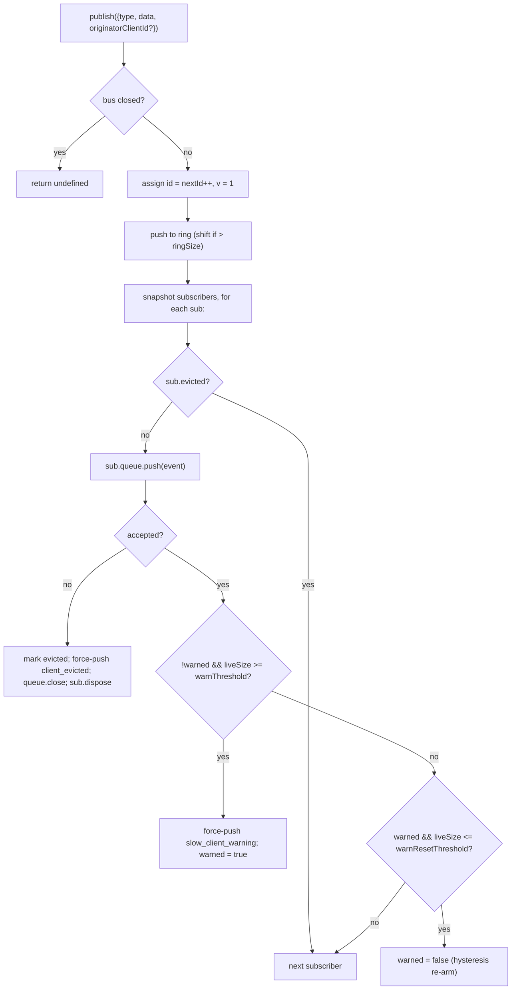

# SSE 事件总线与反压
## 概览

`EventBus`（`packages/acp-bridge/src/eventBus.ts`）是每 session 一份的内存 pub/sub，喂给 daemon 的 `GET /session/:id/events` SSE 路由。它给每个事件分配单调 id、用有界环形缓冲缓存最近事件给 `Last-Event-ID` 重放、把 publish 扇出到所有订阅者、对订阅者实施反压（队列 75% 满时发警告、达到上限时驱逐），还会合成两种终态帧（`client_evicted`、`slow_client_warning`），SDK 把它们当一等事件，但 bus 故意**不**给它们分配 `id`，防止它们占掉本 session 的序列号让其他订阅者看到断档。

`EventBus` 目前是 `acp-bridge` 包内部的实现，bridge 工厂为每 session 闭包持有一份。未来 refactor（文件 line 150–159 提到）会把它升到顶层组件，channels、dual-output 以及未来 WebSocket 传输都能通过同一 bus 订阅，而不必各跑一条并行流。

## 职责

- 给每 session 分配单调事件 id（从 1 起）。
- 在环形缓冲缓存最近 `ringSize` 个事件，供 `lastEventId` 重放。
- 把 publish 扇出到至多 `maxSubscribers` 个订阅者。
- 每订阅者用有界队列；超过上限的订阅者收一个合成终态帧 `client_evicted` 后被关掉。
- 队列 75% 满时合成 `slow_client_warning` —— 每个 overflow episode 只发一次，37.5% 滞回重新装填。
- `AbortSignal.abort()` 触发后及时拆订阅。
- bus close 时（session 拆除）干净地关闭所有订阅者。
- `publish` 永远不抛（合约：调 `publish` 永远安全）。

## 架构

| 常量                                    | 值          | 用途                                                       |
| --------------------------------------- | ----------- | ---------------------------------------------------------- |
| `EVENT_SCHEMA_VERSION`                  | `1`         | 每帧 `v`；frame 形状破坏性改动时 bump                      |
| `DEFAULT_RING_SIZE`                     | `8000`      | per-session 重放环；operator 通过 `--event-ring-size` 覆盖 |
| `DEFAULT_MAX_QUEUED`                    | `256`       | per-subscriber 队列上限                                    |
| `DEFAULT_MAX_SUBSCRIBERS`               | `64`        | per-session 订阅者上限                                     |
| `WARN_THRESHOLD_RATIO`                  | `0.75`      | 触发 `slow_client_warning` 的占比                          |
| `WARN_RESET_RATIO`                      | `0.375`     | 滞回重置占比                                               |
| `MAX_EVENT_RING_SIZE`（在 `bridge.ts`） | `1_000_000` | `BridgeOptions.eventRingSize` 软上限，挡打错值 OOM         |

### `BridgeEvent`

```ts
interface BridgeEvent {
  id?: number; // per session 单调；合成终态帧无 id
  v: 1; // EVENT_SCHEMA_VERSION
  type: string; // 29 已知 type 之一或未来扩展
  data: unknown; // payload，SDK 按 type typed（详见 09）
  originatorClientId?: string; // 由带 clientId 的请求派生
}
```

### `SubscribeOptions`

```ts
interface SubscribeOptions {
  lastEventId?: number; // 从该 id 之后重放（Last-Event-ID 重连）
  signal?: AbortSignal; // 及时拆订阅
  maxQueued?: number; // per-subscriber 队列上限；默认 256
}
```

`subscribe()` 返回 `AsyncIterable<BridgeEvent>`。SSE 路由用 `for await` 消费。注册是**同步**的 —— `subscribe()` 返回时订阅者已经挂上，所以与消费者第一次 `next()` race 的 `publish()` 仍会被投递。

### `BoundedAsyncQueue`

每订阅者的队列，两个关键行为：

- **上限只算 LIVE 项**。`forcePush()` 进的项每条带 `forced: true` 标签，不计入 `maxSize`。这让 `Last-Event-ID` 重放可以强推数百历史帧到新订阅者而不会立刻撞到 live 上限把刚 resume 的订阅者驱逐。
- **`liveCount` 是字段**，不是由 `forcedInBuf` 位置推导的。之前位置推导在 `slow_client_warning` 开始 mid-stream 强推（推到队尾，不是像 replay 那样推到队头）后就坏了；每条 `forced` 标签位置无关。

`push(value)` 在 LIVE 上限时返回 `false`（既不阻塞也不抛），bus 据此驱逐订阅者。`forcePush(value)` 绕过上限。`close({drain?: boolean})` 默认 drain 已有项；abort 路径用 `drain: false` 直接丢弃。

## 流程

### Publish



`publish` 永远不抛。关闭 bus 之中 publish（shutdown 路径在 await `channel.kill()` 前关每个 session 的 bus）返回 `undefined` 而不是抛，因为 agent 在 bus close 与 channel kill 之间的窗口里还可能发 `sessionUpdate` 通知。

### Subscribe + replay（带环驱逐检测）

```mermaid
sequenceDiagram
    autonumber
    participant SR as SSE route
    participant EB as EventBus
    participant Q as BoundedAsyncQueue

    SR->>EB: subscribe({lastEventId: 42, maxQueued: 256, signal})
    EB->>EB: refuse if subs.size >= maxSubscribers<br/>(throws SubscriberLimitExceededError)
    EB->>Q: new BoundedAsyncQueue(256)
    EB->>EB: subs.add(sub)
    EB->>EB: earliestInRing = ring[0]?.id
    alt earliestInRing > lastEventId + 1 (gap evicted)
        EB->>Q: forcePush state_resync_required<br/>{ reason: 'ring_evicted', lastDeliveredId: 42, earliestAvailableId: earliestInRing }
        Note over EB,Q: id-less synthetic, frame goes BEFORE replay.<br/>Stream stays open; SDK reducer flips awaitingResync.
    end
    loop ring scan
        EB->>EB: for e in ring where e.id > 42
        EB->>Q: forcePush(e)
    end
    EB->>EB: attach AbortSignal listener<br/>(onAbort → queue.close({drain:false}); dispose)
    EB-->>SR: AsyncIterable
    SR->>Q: next() in for-await loop
```

subscribe 时 `subs.size >= maxSubscribers` 抛 `SubscriberLimitExceededError`，SSE 路由捕获并给被拒客户端序列化一个 `stream_error` 合成帧，免得他们看到一片空。返回空 iterable 会让 oncall 在高负载下分不清「有的客户端收到了，有的没收到」。

### 环驱逐 → `state_resync_required`（恢复流）

当消费方带 `Last-Event-ID: N` 重连，但环里最早留存事件的 `id > N + 1`，说明 `[N+1, earliestInRing-1]` 这段在重连前被 evict 了。朴素重放会默默成功但拿到一个非连续后缀，SDK reducer 当作连续流继续 apply delta，状态就与 daemon 真相分叉 —— 全程没有终态信号。

实现在 `packages/acp-bridge/src/eventBus.ts:359-402`：

1. 算 `earliestInRing = this.ring[0]?.id`。
2. 若 `earliestInRing > opts.lastEventId + 1`，在重放帧**之前**强推一帧合成：
   ```jsonc
   {
     "v": 1,
     "type": "state_resync_required",
     "data": {
       "reason": "ring_evicted",
       "lastDeliveredId": <opts.lastEventId>,
       "earliestAvailableId": <earliestInRing>
     }
   }
   ```
3. 之后照常做重放循环。

关键契约（以及 wenshao #4360 review 修正过的几点）：

- **无 `id`** —— 与 `client_evicted` 同样的「不占位」模式，不会占掉 per-session 单调序列号让其他订阅者看到断档。
- **流保持打开** —— 不同于 `client_evicted`（真终态），`state_resync_required` 面向恢复。重放和 live 帧继续。
- **reducer 自动跳过 delta** —— SDK 端 `awaitingResync = true`，只放行 `state_resync_required` 本身加四个终态帧（`session_died`、`session_closed`、`client_evicted`、`stream_error`），直到调用方调 `loadSession` 清掉标志。详见 [`09-event-schema.md`](./09-event-schema.md) 的 `RESYNC_PASSTHROUGH_TYPES`。
- **省网络** —— 帧仍然走线，SDK 之后可以计算「漏了什么」的 diff，不需要额外重连一次。

### 驱逐终态

订阅者 LIVE 队列已到 `maxQueued`，再来一次 `push()` 返回 `false`：

1. 标 `sub.evicted = true`。
2. 构造 `client_evicted` 帧，**无 `id`** —— `{ v: 1, type: 'client_evicted', data: { reason: 'queue_overflow', droppedAfter: <最后投递的 id> } }`。
3. `queue.forcePush(evictionFrame)` 让消费者 iterator 看到一个终态帧。
4. `queue.close()` 让 iterator 在终态帧后 unwind。
5. `sub.dispose()` —— 从 `subs` 移除**并且**解绑 `AbortSignal` listener（**BmJT1 修复**：不这么做时，卡住的消费者闭包会一直存活到 `AbortSignal` 自己 GC）。

### Abort 流

`AbortSignal.abort()` → `onAbort()`：

1. `queue.close({drain: false})` —— 丢弃已缓冲项，免得 SSE 路由继续往没人看的 socket 序列化事件。
2. `dispose()` —— 通过 `disposed` 标志幂等。

subscribe 时已 abort 的 signal 会在返回 iterator 前同步调一次 `onAbort()`。

## 状态与生命周期

- `nextId` 从 1 起只增不减；`lastEventId` getter 返回 `nextId - 1`。
- `ring` 有界；满了之后 `shift` 是 O(n)。`ringSize=8000` 在聊天密集 session 上每次 publish 几毫秒，远低于 per-frame 延迟预算。circular-buffer refactor 推迟到 profiling 真的标出它，或 operator 把 `--event-ring-size` 提一个数量级时再做。
- `close()` 翻转 `closed`、关掉所有订阅者队列、清空 `subs`。之后 `publish()` / `subscribe()` 都是 no-op（`publish` 返 undefined，`subscribe` 返 `emptyAsyncIterable`）。
- 每 session 一个 `EventBus`。bus close 发生在 `channel.kill()` 之前，shutdown 中飞行的 publish 返 undefined 而不抛。

## 依赖

- 被 `packages/acp-bridge/src/bridge.ts` 消费（`BridgeClient.sessionUpdate` / `extNotification` → `events.publish(...)`）。
- 被 `packages/cli/src/serve/server.ts` 消费（SSE 路由 → `events.subscribe(...)`，再把 `BridgeEvent` 序列化为 SSE wire）。
- re-export shim：`packages/cli/src/serve/eventBus.ts` → `@qwen-code/acp-bridge/eventBus`。
- SDK 消费方：`packages/sdk-typescript/src/daemon/sse.ts`（`parseSseStream`），之后接 `narrowDaemonEvent`（详见 [`09-event-schema.md`](./09-event-schema.md)、[`13-sdk-daemon-client.md`](./13-sdk-daemon-client.md)）。

## 配置

- `--event-ring-size <n>` — per-session 环深度，软上限 `MAX_EVENT_RING_SIZE = 1_000_000`。
- `GET /session/:id/events` 上的 `?maxQueued=N` query 参数，范围 `[16, 2048]`，SDK 在 opt-in 前 pre-flight `caps.features.slow_client_warning`。
- `BridgeOptions.eventRingSize`（嵌入用例覆盖 daemon 默认）。
- 能力 tag：`session_events`、`slow_client_warning`、`typed_event_schema`。

## 注意 & 已知局限

- **合成帧无 `id`**。SDK 用 `Last-Event-ID` 重连时不能假设序号连续 —— live 流里看到 「事件 3、5、6，缺 4」是正常的（如果 4 是当时强推给该订阅者的 `slow_client_warning` 或 `client_evicted`，那帧是私有的）。
- `client_evicted` 是 **per-subscriber** 不是 per-session，同一客户端可以重连。
- `BoundedAsyncQueue` iterator **不支持并发驱动** —— 两次同时 `.next()` 会 race 同一事件。生产环境是顺序消费（SSE 路由的 `for await`），安全。
- bus 目前包私有；channels 和 webui 想订阅必须走 daemon HTTP SSE 路由，不能直接 reach 进 bus。Stage 1.5 会把它升到顶层。

## 参考

- `packages/acp-bridge/src/eventBus.ts`（整文件）
- `packages/acp-bridge/src/bridge.ts`（publish 站点，特别是 `BridgeClient.sessionUpdate` 和 F3 权限事件）
- `packages/cli/src/serve/server.ts`（SSE 路由 handler — 把 `BridgeEvent` 序列化为 wire SSE）
- `packages/sdk-typescript/src/daemon/sse.ts`（客户端 SSE wire 解析器）
- wire 参考：[`../qwen-serve-protocol.md`](../qwen-serve-protocol.md)（`Last-Event-ID` 重连合约）。
