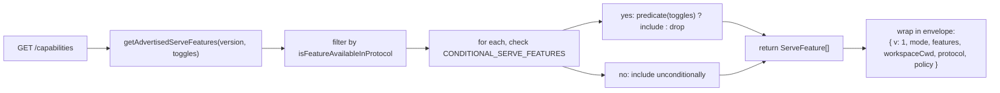
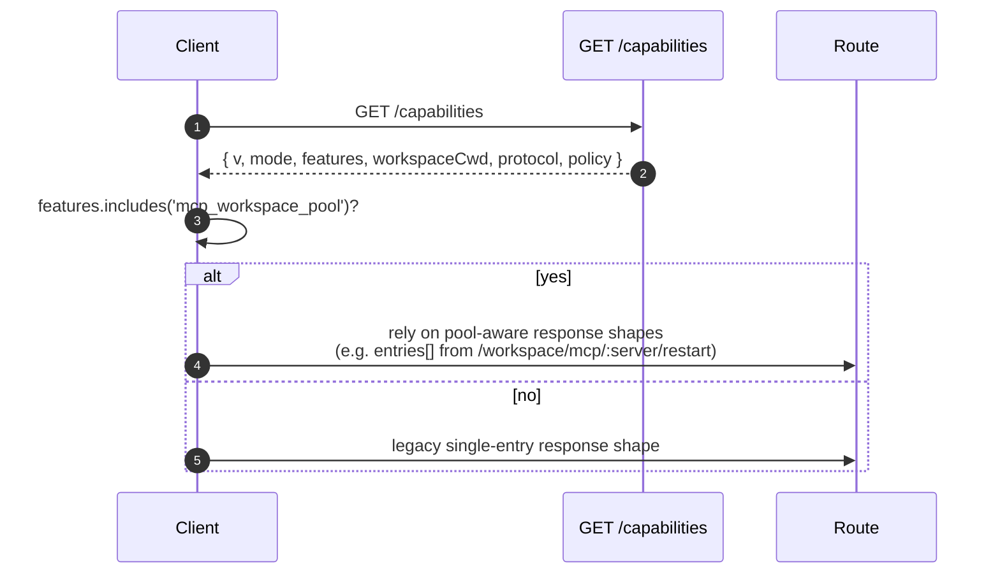

# 能力协商与协议版本
## 概览

`GET /capabilities` 是 daemon 的 pre-flight 出口。每个 SDK 客户端应该在任何其他路由之前先读它，了解 daemon 说哪个协议版本、开了哪些 feature tag、绑定到哪个 workspace。合约：

- **只有一个协议版本 `v1`。** `SERVE_PROTOCOL_VERSION = 'v1'`、`SUPPORTED_SERVE_PROTOCOL_VERSIONS = ['v1']`。v1 内部纯加法；frame 形态破坏性改动留给 v2。
- **每 tag 一个 `since` 版本**，未来 v2 可以同时广播 v1 与 v2 tag。
- **条件广播**。三个 tag（`require_auth`、`mcp_workspace_pool`、`mcp_pool_restart`）只在对应部署开关打开时才广播；tag 存在 = 行为存在。
- **Capability tag = 行为契约**。在已有 tag 下加新行为会悄悄破坏已有的 pre-flight 检查；**新行为对应新 tag**。

完整注册表在 `packages/cli/src/serve/capabilities.ts:37-215`。

## 职责

- 声明 daemon 可能广播的每个 feature。
- 按协议版本 + 部署开关过滤实际广播的 feature。
- 暴露 `getRegisteredServeFeatures()`（全 key、不过滤）、`getAdvertisedServeFeatures(version, toggles)`（过滤后）、`getServeProtocolVersions()`（envelope：`{current, supported}`）。
- 守住「tag 存在 = 行为存在」的不变式 —— `server.test.ts` 的「every conditional tag advertises when its toggle is on」测试遍历 `CONDITIONAL_SERVE_FEATURES` 的 key，没写 predicate 的新 tag 直接挂测。

## 架构

### Capability envelope

`/capabilities` 返回：

```ts
{
  v: 1,                    // CAPABILITIES_SCHEMA_VERSION
  mode: 'http-bridge',
  features: ServeFeature[],
  workspaceCwd: string,
  protocol?: { current: 'v1', supported: ['v1'] },
  policy?: { permission: PermissionPolicy },
}
```

`workspaceCwd` 是 daemon 绑定的规范化 workspace（详见 [`02-serve-runtime.md`](./02-serve-runtime.md)）。`policy.permission` 是当前激活的 mediator 策略。

### `ServeCapabilityDescriptor`

```ts
interface ServeCapabilityDescriptor {
  since: ServeProtocolVersion; // current = 'v1'
  modes?: readonly string[]; // 多种操作模式时列出
}
```

v1 用到 `modes` 的两个 tag：

- `mcp_guardrails: { since: 'v1', modes: ['warn', 'enforce'] }` —— 客户端依赖 refusal 行为前 pre-flight `'enforce'`。
- `permission_mediation: { since: 'v1', modes: ['first-responder', 'designated', 'consensus', 'local-only'] }` —— 客户端在这里看到**构建期支持集**；daemon 的**激活策略**在 envelope 的 `policy.permission`。

### 条件 tag

```ts
export const CONDITIONAL_SERVE_FEATURES: ReadonlyMap<
  ServeFeature,
  (toggles: AdvertiseFeatureToggles) => boolean
> = new Map([
  ['require_auth', (t) => t.requireAuth === true],
  ['mcp_workspace_pool', (t) => t.mcpPoolActive === true],
  ['mcp_pool_restart', (t) => t.mcpPoolActive === true],
]);
```

`Map` 形状把「predicate 判断」和「集合成员」收成一条记录。加一个新条件 tag 要**两处协调修改**：

1. 在 `SERVE_CAPABILITY_REGISTRY` 注册 tag 及其 `since`。
2. 在 `CONDITIONAL_SERVE_FEATURES` 加 predicate。

基线 tag（Map 里没有）无条件广播 —— 这个决定是**用「不写」表达**的，不需要专门维护一个 Set。

### 38 个 tag（v1，按域）

Foundation：`health`、`capabilities`。

Sessions：`session_create`、`session_scope_override`、`session_load`、`unstable_session_resume`、`session_list`、`session_prompt`、`session_cancel`、`session_events`、`session_set_model`、`session_close`、`session_metadata`、`session_context`、`session_supported_commands`、`session_approval_mode_control`。

Streaming：`slow_client_warning`、`typed_event_schema`。

Identity & heartbeat：`client_identity`、`client_heartbeat`。

Permissions：`session_permission_vote`、`permission_vote`、**`permission_mediation`**（`modes: ['first-responder', 'designated', 'consensus', 'local-only']`）。

Workspace 只读快照：`workspace_mcp`、`workspace_skills`、`workspace_providers`、`workspace_env`、`workspace_preflight`。

Workspace 修改（Wave 4）：`workspace_memory`、`workspace_agents`、`workspace_tool_toggle`、`workspace_init`、`workspace_mcp_restart`、`workspace_file_read`、`workspace_file_bytes`、`workspace_file_write`。

MCP guardrails：**`mcp_guardrails`**（`modes: ['warn', 'enforce']`）、`mcp_guardrail_events`、**`mcp_workspace_pool`**（条件）、**`mcp_pool_restart`**（条件）。

Auth：`auth_device_flow`、**`require_auth`**（条件）。

（粗体 = 带 `modes` 或条件。）

## 流程

### Daemon 端：装 envelope



### 客户端：feature pre-flight



## 状态与生命周期

- `CAPABILITIES_SCHEMA_VERSION` 是 wire envelope 的形状版本（当前 `1`）。bump 它是对 envelope 本身的 break。
- `SERVE_PROTOCOL_VERSION = 'v1'` 是协议-feature 版本。v1 内加 feature 是加法；老客户端不 pre-flight 新 tag 就看不到，**移除** feature 才是 v2 break。
- `EVENT_SCHEMA_VERSION = 1` 是 SSE frame 的 `v` 字段（见 [`09-event-schema.md`](./09-event-schema.md)），独立版本轴；bump 事件 schema 不必 bump 协议版本，反之亦然。
- `unstable_session_resume` 故意带 `unstable_` 前缀，因为 ACP 的 `connection.unstable_resumeSession` 还可能变形状；客户端应 feature-detect 而不是固定 v1。

## 依赖

- 被 `packages/cli/src/serve/server.ts` 读来装 `/capabilities` 响应。
- Toggle 输入：`runQwenServe` 构造 `{ requireAuth: opts.requireAuth, mcpPoolActive: opts.mcpPoolActive }` 透传到 envelope。
- envelope 中激活的 `permission` 策略来自 `BridgeOptions.permissionPolicy`（其本身读 `settings.json` 的 `policy.permissionStrategy`）。

## 配置

| 来源            | 旋钮                                                            | 对 capabilities 的影响                                                              |
| --------------- | --------------------------------------------------------------- | ----------------------------------------------------------------------------------- |
| 参数            | `--require-auth`                                                | `require_auth` tag 出现                                                             |
| Env             | `QWEN_SERVE_NO_MCP_POOL=1`                                      | `mcp_workspace_pool` + `mcp_pool_restart` 消失；MCP 事件不再盖 `scope: 'workspace'` |
| 参数            | `--mcp-client-budget=N`、`--mcp-budget-mode={off,warn,enforce}` | 不改 tag 集合（`mcp_guardrails` 永远广播），但改 per-server 预留 + refusal 行为     |
| `settings.json` | `policy.permissionStrategy`                                     | 设 envelope 的 `policy.permission`                                                  |

## 注意 & 已知局限

- **`--require-auth` 遮蔽 pre-flight**。开 `--require-auth` 时所有路由（包括 `/capabilities`）都要 bearer。未认证客户端无法 pre-flight `caps.features.require_auth` 来发现需要认证；这种情形下**401 响应体**就是发现 surface（详见 [`12-auth-security.md`](./12-auth-security.md)）。`require_auth` tag 是**认证后确认**，给加固部署的审计 UI 用。
- **Tag 存在 = 行为存在**。如果未来贡献者在已有 tag 下加行为且没 bump `since`，pre-flight 旧 tag 的 SDK 会默默拿到新行为。约定：**新行为对应新 tag**。
- **`unstable_*` tag 可能在版本之间变形状**且不 bump 协议版本。依赖时硬绑 SDK 版本。
- 路由清单在 [`../qwen-serve-protocol.md`](../qwen-serve-protocol.md)，本文刻意不重复。

## 参考

- `packages/cli/src/serve/capabilities.ts:1-330`（整文件）
- `packages/cli/src/serve/types.ts:37-155`（`ServeOptions`、`CapabilitiesEnvelope`）
- `packages/cli/src/serve/server.ts`（envelope 装配）
- `packages/acp-bridge/src/eventBus.ts:22`（`EVENT_SCHEMA_VERSION`）
- wire 参考：[`../qwen-serve-protocol.md`](../qwen-serve-protocol.md)。
