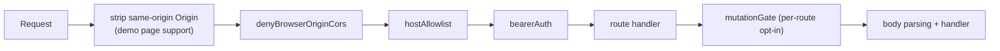
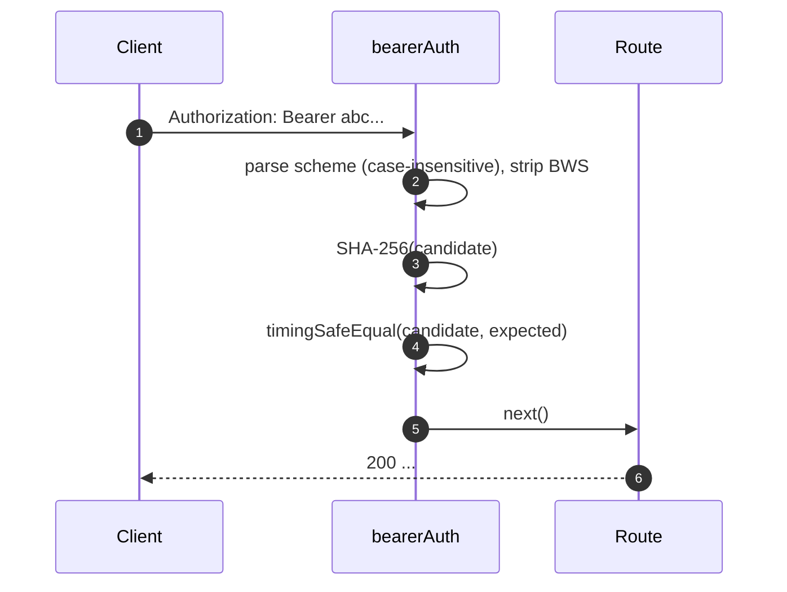
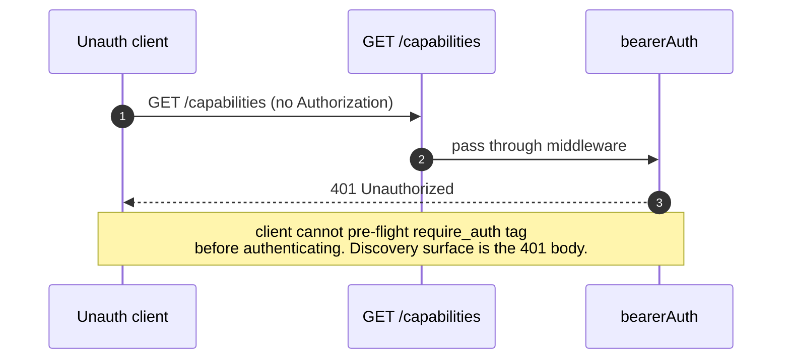
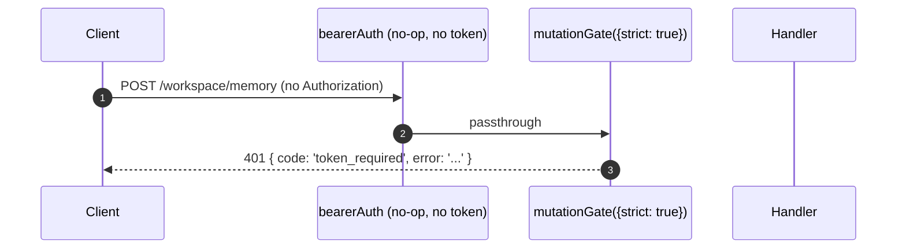

# 认证与安全模型
## 概览

`qwen serve` 默认是本地 daemon，配错就是暴露面。安全模型**分层**，错配时 fail-closed：

1. **绑定** — 非 loopback 绑定无 bearer token **拒启动**。
2. **Bearer auth** — `bearerAuth` 中间件，常量时间 SHA-256 比较，覆盖除 loopback 上 `/health` 之外的每条路由（`require_auth` 把它扩展到 loopback 与 `/health`）。
3. **Host 白名单** — loopback 上只接受 `localhost`、`127.0.0.1`、`[::1]`、`host.docker.internal`（带端口），防 DNS rebinding。
4. **Origin 拒绝** — 任何带 `Origin` 头的请求 `403`。CLI / SDK 永远不发 `Origin`，只有浏览器发。
5. **每路由 mutation gate** — Wave 4 修改类路由 opt-in，「即便 loopback 无 token 也 401」并带专有 `code: 'token_required'`。
6. **Device-flow auth** — Provider OAuth 流的独立 surface（`POST /workspace/auth/device-flow` + GET/DELETE on `/:id`）。

本文讲清每一层和 boot 路径强制的每个不变式。

## 职责

- 不安全配置直接拒启动。
- 通过 bearer（配了的话）+ host（loopback）+ origin 检查闸所有 HTTP 请求。
- 为 Wave 4 路由提供 per-route mutation gate。
- 托管 device-flow registry 驱动 provider OAuth 流并通过 SSE 事件可见。

## 架构

### 启动期 refuse 规则

`runQwenServe.ts`：

```ts
if (!isLoopbackBind(opts.hostname) && !token) {
  throw new Error('Refusing to bind <host>:<port> without a bearer token. ...');
}
if (opts.requireAuth && !token) {
  throw new Error(
    'Refusing to start with --require-auth set but no bearer token configured. ...',
  );
}
```

两个拒绝都是 boot-loud（stderr / 抛给嵌入方），从不静默。#3803 的威胁模型明文禁止 daemon 默默裸跑到 loopback 之外。

### 中间件链（HTTP 请求顺序）



（`mutationGate` 是 per-route 中间件，可以选择性 `strict: true`，详见 `packages/cli/src/serve/auth.ts:1-294`。）

### `bearerAuth`

- **没配 token** → 中间件是 no-op（loopback dev 默认）。
- **配了 token** → 构造时把 token SHA-256 一次；每请求把 candidate 哈希再 `timingSafeEqual` 比较；不走字符串等值短路，不漏时序信息。
- **scheme 解析**：`Bearer` 大小写不敏感（RFC 7235 §2.1），scheme 与凭证之间允许 `SP\tHTAB` BWS（RFC 7230 §3.2.6），但纯 HTAB 作分隔被拒。
- **CodeQL 加固**：手写 `indexOf` 解析而不是带 `\s+` / `.+` 重叠的正则，避免多项式正则风险。

### `hostAllowlist`

仅 loopback。按端口缓存 `Set<string>`。允许的 Host：

- `localhost:<port>`、`127.0.0.1:<port>`、`[::1]:<port>`、`host.docker.internal:<port>`。
- 加上无端口形式（`localhost`、`127.0.0.1`、`[::1]`、`host.docker.internal`），**仅**当绑端口 80 时（RFC 7230 §5.4 默认端口省略）。

Host 比较**大小写不敏感** —— Express 规范 header 名但不规范值，Docker 代理大写 Host（`Localhost:4170`、`HOST.docker.internal`）严格比对会 403。

非 loopback 绑定跳过该中间件（operator 选了暴露面，bearer 顶上挡 Host 伪造）。

### `denyBrowserOriginCors`

任何带 `Origin` 的请求直接 `403 { error: 'Request denied by CORS policy' }`。CLI/SDK 永不发 `Origin`，只有浏览器发。返回确定性 403 而不是 `cors` 包错误回调的 500 HTML。

例外：demo 页的同源 XHR 由 `server.ts` 里另一个中间件先把匹配本机地址的 `Origin` 剥掉。

### `createMutationGate`

per-route opt-in 闸门。行为矩阵：

| daemon 配置              | route opts      | 结果                             |
| ------------------------ | --------------- | -------------------------------- |
| `requireAuth=true`       | 任意            | passthrough¹                     |
| 配了 `token`             | 任意            | passthrough²                     |
| 无 token（loopback dev） | `strict: false` | passthrough                      |
| 无 token（loopback dev） | `strict: true`  | `401 { code: 'token_required' }` |

¹ `--require-auth` 只在配了 token 时启动，全局 `bearerAuth` 已经 401 过未认证调用。
² 配了 token 的任何路径，全局 `bearerAuth` 都强制 bearer；这里冗余但无害。

`code: 'token_required'` 与 `bearerAuth` 普通 `Unauthorized` 不同形状，SDK 据此渲染「请用 --token / --require-auth 启动 daemon」提示而不是泛 401。

**Wave 4 strict 路由**：`/workspace/memory`、`/workspace/agents/*`、`/file/write`、`/file/edit`、`/workspace/tools/:name/enable`、`/workspace/mcp/:server/restart`、`/workspace/auth/device-flow`、`/workspace/init`、`/session/:id/approval-mode`。

### `/health` 豁免

loopback 绑定上，`/health` 注册在 bearer 中间件**之前**，pod 内部 liveness 探针不必带 token。非 loopback 绑定下 `/health` 也走 bearer。`--require-auth` 撤销豁免：loopback 上 `/health` 也要 `Authorization: Bearer <token>`。

### v1 的 client 身份 (`X-Qwen-Client-Id`) 是自报

daemon 只校验 `X-Qwen-Client-Id` 的格式（`[A-Za-z0-9._:-]{1,128}`）并按 session 跟踪 attach 的 client id；当下**不做** proof-of-possession 检查。客户端只要观察到 SSE 帧里的 `originatorClientId` 就能用同 id 重新注册，在后续请求里冒充 originator。

影响范围：**`designated`** 策略（远端可以伪装 originator 给本应只属于 prompt 发起人的请求投票）；**`consensus`** 策略（如果 `votersAtIssue` 快照里已经有伪装 id，它能投）。**不**影响 `local-only`（按 `fromLoopback` 闸，daemon 按连接 remote address 盖戳），**不**影响 `first-responder`（与身份无关）。

「pair-token」机制（`POST /session` 时 daemon 发一个 per-session secret，`designated` / `consensus` 投票必须带）将来 PR 落地。当下需要加固 designated 策略的部署应当绑 loopback 或挂在做认证的反代后面。详见 [`04-permission-mediation.md`](./04-permission-mediation.md) 各策略的具体影响。

### Device-flow auth

provider 认证（Qwen OAuth 等）的独立 OAuth surface：

- `POST /workspace/auth/device-flow` — 启动一个流；返回 `{deviceFlowId, providerId, expiresAt, verificationUrl, userCode}`。
- `GET /workspace/auth/device-flow/:id` — 轮询状态。
- `DELETE /workspace/auth/device-flow/:id` — 取消。
- `GET /workspace/auth/status` — 当前账号 / provider 快照。

SSE 事件 `auth_device_flow_{started, throttled, authorized, failed, cancelled}` 把流状态扇出给所有订阅者，多客户端 UI 同步。见 [`09-event-schema.md`](./09-event-schema.md)。

实现：`packages/cli/src/serve/auth/deviceFlow.ts` + `qwenDeviceFlowProvider.ts`。

**日志注入 / Trojan-Source 防御**：`sanitizeForStderr(value)`（`deviceFlow.ts:47-72`）剥掉 ASCII C0 / DEL / C1 控制字符**外加** Unicode 同形字符 —— 恶意 IdP 可能用它们伪造日志行或隐藏 payload：

| 范围                             | 为什么剥                                                                                                                                                                                                          |
| -------------------------------- | ----------------------------------------------------------------------------------------------------------------------------------------------------------------------------------------------------------------- |
| `\x00–\x1f`、`\x7f`、`\x80–\x9f` | ASCII C0 / DEL / C1，日志行伪造、终端控制序列                                                                                                                                                                     |
| U+200B–U+200F                    | 零宽字符 + LRM / RLM，隐形但能改终端渲染                                                                                                                                                                          |
| U+2028–U+2029                    | LINE / PARAGRAPH SEPARATOR，许多 Unicode-aware 终端把它当换行，最直接的日志伪造向量                                                                                                                               |
| U+202A–U+202E                    | 双向 EMBEDDING / OVERRIDE 控制                                                                                                                                                                                    |
| U+2066–U+2069                    | 双向 ISOLATE 控制（LRI / RLI / FSI / PDI），[CVE-2021-42574 "Trojan Source"](https://trojansource.codes/) 主攻击向量。恶意 IdP 用 U+2066 (LRI) 替换 U+202D (LRO) 会绕过 EMBEDDING/OVERRIDE 范围却达到同样视觉重排 |
| U+FEFF                           | BOM / 零宽不折断空格                                                                                                                                                                                              |

长度保持（每个被剥码点替换为 `?` 而不是消失），operator 在那索引处仍能看出有东西曾经在。两层都用：`qwenDeviceFlowProvider` 净化 IdP 的 `oauthError`，registry 的 late-poll 观察者净化插值进 audit hint 的 provider 可控值（`latePollResult.kind` / `lateErr.name`）。

**日志注入 / Trojan-Source 防御**：`sanitizeForStderr(value)`（`deviceFlow.ts:47-72`）剥掉 ASCII C0 / DEL / C1 控制字符**外加** Unicode 同形字符 —— 恶意 IdP 可能用它们伪造日志行或隐藏 payload：

| 范围                             | 为什么剥                                                                                                                                                                                                          |
| -------------------------------- | ----------------------------------------------------------------------------------------------------------------------------------------------------------------------------------------------------------------- |
| `\x00–\x1f`、`\x7f`、`\x80–\x9f` | ASCII C0 / DEL / C1，日志行伪造、终端控制序列                                                                                                                                                                     |
| `​–‏`                            | Zero-width 字符 + LRM/RLM，隐形但能改终端渲染                                                                                                                                                                     |
| `–`                              | LINE / PARAGRAPH SEPARATOR，许多 Unicode-aware 终端把它当换行，最直接的日志伪造向量                                                                                                                               |
| `‪–‮`                            | 双向 EMBEDDING / OVERRIDE 控制                                                                                                                                                                                    |
| `⁦–⁩`                            | 双向 ISOLATE 控制（LRI / RLI / FSI / PDI），[CVE-2021-42574 "Trojan Source"](https://trojansource.codes/) 主攻击向量。恶意 IdP 用 U+2066 (LRI) 替换 U+202D (LRO) 会绕过 EMBEDDING/OVERRIDE 范围却达到同样视觉重排 |
| ``                              | BOM / 零宽不折断空格                                                                                                                                                                                              |

长度保持（每个被剥码点替换为 `?` 而不是消失），operator 在那索引处仍能看出有东西曾经在。两层都用：`qwenDeviceFlowProvider` 净化 IdP 的 `oauthError`，registry 的 late-poll 观察者净化插值进 audit hint 的 provider 可控值（`latePollResult.kind` / `lateErr.name`）。

`auth_device_flow` 能力 tag **无条件**广播；路由本身在 daemon 不支持指定 provider 时返 `400 unsupported_provider`。支持的 provider 列表在 `/workspace/auth/status` 而不是 `/capabilities`，保持 descriptor 形状统一。

## 流程

### Bearer auth 正路



### Bearer auth 失败模式

都返 `401 { error: 'Unauthorized' }`（`missing header` / `wrong scheme` / `wrong token` 一致），探测者无法区分。

### `--require-auth` 阴影



认证成功后 `caps.features.includes('require_auth')` 确认部署是 hardened。

### Wave-4 mutation gate 在无 token loopback 上



## 状态与生命周期

- Bearer token 在 boot 读取并 trim（防 `cat token.txt` 带尾换行默默永不匹配）。
- 允许 Host 集合按端口缓存；端口变（ephemeral `0` → `listen` 后的真实端口）才重建。
- mutation gate 在应用构造时构造 `passthrough` 和 `strictDenier` 一次；每路由调用返回缓存闭包（无 per-request 分配）。
- device-flow registry 在 `shutdown()` 第一阶段释放，pending flow 在 HTTP 收尾前解析为 `cancelled`。

## 依赖

- `node:crypto` —— `createHash`、`timingSafeEqual`。
- `packages/cli/src/serve/loopbackBinds.ts` —— `isLoopbackBind`。
- `packages/cli/src/serve/auth/deviceFlow.ts` —— device-flow 状态机。
- `@qwen-code/acp-bridge` —— 把 device-flow 事件吐到 per-session SSE bus。

## 配置

| 来源     | 旋钮                                             | 效果                                                                  |
| -------- | ------------------------------------------------ | --------------------------------------------------------------------- |
| Env      | `QWEN_SERVER_TOKEN`                              | Bearer token（trim 后）                                               |
| 参数     | `--token`                                        | Bearer token（覆盖 env）                                              |
| 参数     | `--require-auth`                                 | Bearer 扩展到 loopback + `/health`。仅在配了 token 时启动             |
| 参数     | `--hostname`                                     | 非 loopback 绑定要求 `--token`（或 env）                              |
| 能力 tag | `require_auth`（条件）、`auth_device_flow`（恒） | 见 [`11-capabilities-versioning.md`](./11-capabilities-versioning.md) |

## 注意 & 已知局限

- **`--require-auth` 遮蔽 feature pre-flight**。未认证客户端无法发现 `require_auth` tag；它们的发现 surface 是 401 响应体。
- **mutation gate body-parser 顺序**：strict 路径的 401 在 `express.json()` 之后才发；满载 loopback 监听器最坏 `--max-connections × express.json({limit: '10mb'})` ≈ 2.5 GB 瞬时。loopback only，刻意接受。
- **同源 Origin 剥离**发生在 `denyBrowserOriginCors` **之前**；如果未来 refactor 把剥离挪走，demo 页会坏。
- **Token 比较是对 SHA-256 摘要**而不是原始 token，把变长比较收成定长比较，时序泄漏更难做。
- daemon 当前**没有** mTLS / 请求签名 / per-client 限流，那些是 F 系列 Wave 5+ 项目。

## 参考

- `packages/cli/src/serve/auth.ts:1-294`（整文件）
- `packages/cli/src/serve/runQwenServe.ts:341-360`（refuse 规则）
- `packages/cli/src/serve/loopbackBinds.ts`
- `packages/cli/src/serve/auth/deviceFlow.ts`
- `packages/cli/src/serve/auth/qwenDeviceFlowProvider.ts`
- 用户威胁模型：[`../../users/qwen-serve.md`](../../users/qwen-serve.md)。
- wire 参考：[`../qwen-serve-protocol.md`](../qwen-serve-protocol.md)。
