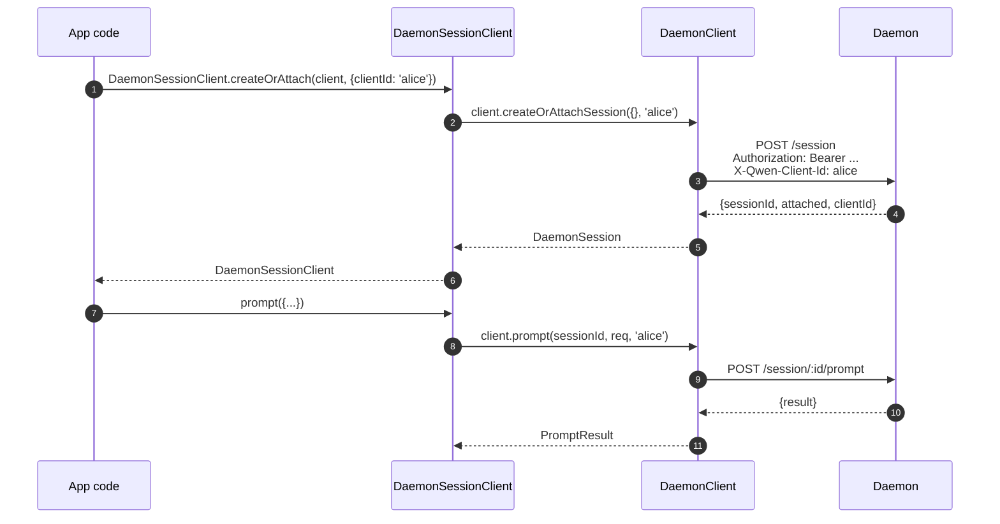
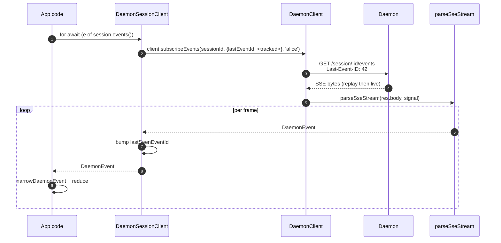
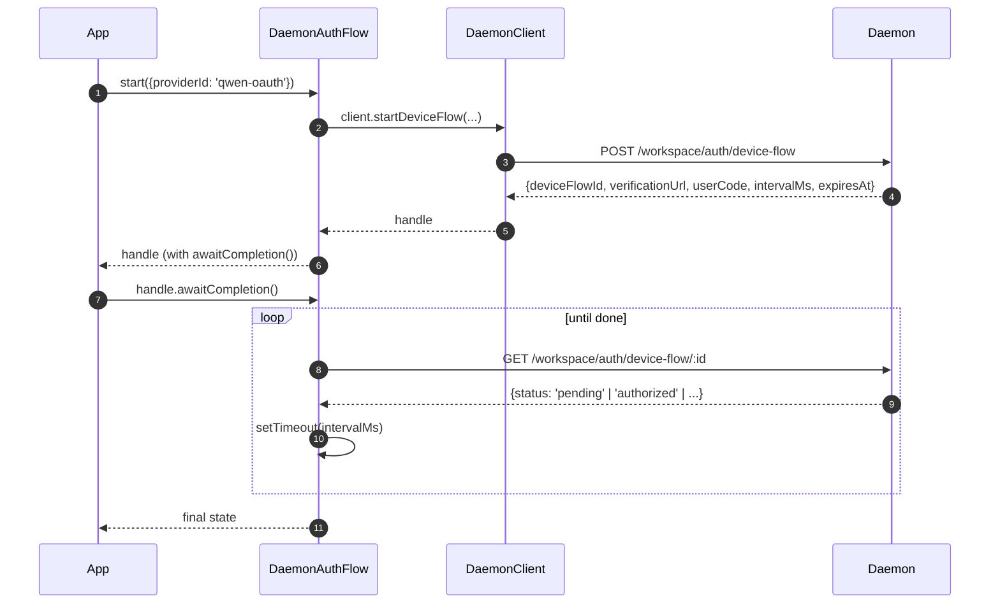

# TypeScript SDK Daemon 客户端
## 概览

`packages/sdk-typescript/src/daemon/` 是 **TypeScript SDK 的 daemon 客户端**。任何 TypeScript / JavaScript 宿主想跟在跑的 `qwen serve` 通话都走它（CLI 自己的 TUI 适配器、channel 机器人后端、VSCode IDE companion、自定义脚本、服务端 Web BFF）。所有其他适配器都依赖它。

包布局有意保持紧凑：

| 文件                     | 暴露                                                                                                                         |
| ------------------------ | ---------------------------------------------------------------------------------------------------------------------------- |
| `index.ts`               | 公开 barrel（`DaemonClient`、`DaemonSessionClient`、`DaemonAuthFlow`、`parseSseStream`、event reducers、types）              |
| `DaemonClient.ts`        | 低层 HTTP/SSE 门面 —— 每条 `qwen-serve-protocol.md` 路由一个方法                                                             |
| `DaemonSessionClient.ts` | session 级封装，自动跟踪 SSE 重放                                                                                            |
| `DaemonAuthFlow.ts`      | 高层 OAuth Device Flow 助手                                                                                                  |
| `sse.ts`                 | `parseSseStream`（NDJSON / SSE 框架解析）                                                                                    |
| `events.ts`              | `narrowDaemonEvent`、`reduceDaemonSessionEvent`、`reduceDaemonAuthEvent`（见 [`09-event-schema.md`](./09-event-schema.md)）  |
| `types.ts`               | `DaemonCapabilities`、`DaemonSession`、`DaemonEvent`、`PermissionResponse`、`PromptResult`、MCP / agent / memory / auth 类型 |

走查示例在 [`../examples/daemon-client-quickstart.md`](../examples/daemon-client-quickstart.md)；本文是架构/契约参考。

## 职责

- 每条 daemon HTTP 路由提供一个 TS 方法。
- 给每请求正确盖 bearer token 和 `X-Qwen-Client-Id`。
- 把 per-call 超时与调用方传入的 `AbortSignal` 组合（不杀长 SSE）。
- 把 SSE 流解析成 typed `DaemonEvent`。
- 每 session 跟踪 `lastSeenEventId`，重连正确重放。
- 暴露 device-flow auth surface 按 daemon 给出的间隔轮询。

## 架构

### `DaemonClient`（`DaemonClient.ts:209-1506`）

构造：

```ts
new DaemonClient({
  baseUrl: string,                  // 默认 'http://127.0.0.1:4170'
  token?: string,
  fetch?: typeof globalThis.fetch,  // 测试可注入
  fetchTimeoutMs?: number,          // 0 = 禁用；默认 DEFAULT_FETCH_TIMEOUT_MS
});
```

方法分组（每个方法可选 `clientId` 用于盖 `X-Qwen-Client-Id`）：

| 组             | 方法                                                                                                                                                                                                                                |
| -------------- | ----------------------------------------------------------------------------------------------------------------------------------------------------------------------------------------------------------------------------------- |
| Plumbing       | `health()`、`capabilities()`、`auth`（lazy `DaemonAuthFlow` accessor）                                                                                                                                                              |
| Sessions       | `createOrAttachSession`、`loadSession`、`resumeSession`、`listSessions`、`closeSession`、`setSessionMetadata`、`getSessionContext`、`getSessionSupportedCommands`、`setSessionApprovalMode`、`setSessionModel`                      |
| Prompting      | `prompt`、`cancel`、`heartbeat`                                                                                                                                                                                                     |
| Events         | `subscribeEvents`（SSE 生成器）、`subscribeEventsStream`（原始 response）                                                                                                                                                           |
| Permissions    | `respondToPermission`、`respondToSessionPermission`                                                                                                                                                                                 |
| Workspace 快照 | `getWorkspaceMcp`、`getWorkspaceSkills`、`getWorkspaceProviders`、`getWorkspaceEnv`、`getWorkspacePreflight`                                                                                                                        |
| Workspace 修改 | `writeWorkspaceMemory`、`readWorkspaceMemory`、`listWorkspaceAgents`、`getWorkspaceAgent`、`createWorkspaceAgent`、`updateWorkspaceAgent`、`deleteWorkspaceAgent`、`toggleWorkspaceTool`、`restartMcpServer`、`initializeWorkspace` |
| Files          | `readFile`、`readFileBytes`、`writeFile`、`editFile`、`listDirectory`、`globPaths`、`statPath`                                                                                                                                      |
| Auth           | `startDeviceFlow`、`pollDeviceFlow`、`cancelDeviceFlow`、`getAuthStatus`                                                                                                                                                            |

### `fetchWithTimeout`（BRN1o 行为）

每个请求都过 `fetchWithTimeout`。关键细节：

- **body 读取在定时器作用域内**。之前实现 header 一到就清定时器；代理在 body 中途卡住时 `await res.json()` 会超过 `fetchTimeoutMs` 仍然 hang。当前形态把读 body 的代码作为 callback 传入，定时器覆盖 header 到 body 全程。
- **`perCallTimeoutMs`** 允许单次调用覆盖 client 级默认。最显眼的使用方是 `restartMcpServer`，SDK 用 `MCP_RESTART_DEFAULT_TIMEOUT_MS = 330_000`（5 分 30 秒）。daemon 自己的 `MCP_RESTART_TIMEOUT_MS` 上限正好是 300 秒 —— client 与之精确相等会与 daemon 响应 race：接近 300 秒完成或失败的重启可能在 daemon 把结构化响应序列化 + 上线 + 编码完之前 client 的 `AbortSignal` 先 fire，给出一个假阳性 `TimeoutError` 而 daemon 其实还在自己预算之内。多出的 30 秒覆盖序列化 + 在线传输 + 两端解码。想要更紧的调用方自己传 `timeoutMs`；传 `0` 完全关闭超时。
- **`AbortSignal.any`** 把调用方信号与 per-call 定时器信号组合，调用方取消和 per-call 超时都干净 abort。
- **`AbortController` + 可取消 `setTimeout`** 而不是 `AbortSignal.timeout()`；快速完成的请求不会在 event loop 上留 pending 定时器。`finally` 里 `clearTimeout`。
- **流式端点（`subscribeEvents`）绕过超时** —— 长 SSE 不能被它杀。

### `DaemonSessionClient`（`DaemonSessionClient.ts:61-385`）

绑一个 session 并自动跟踪 `lastSeenEventId`，SSE 重连重放开箱即用。

```ts
class DaemonSessionClient {
  readonly client: DaemonClient;
  readonly session: DaemonSession;
  readonly state: DaemonSessionState;
  private lastSeenEventId: number | undefined;

  static createOrAttach(client, req?): Promise<DaemonSessionClient>;
  static load(client, sessionId, req?): Promise<DaemonSessionClient>;
  static resume(client, sessionId, req?): Promise<DaemonSessionClient>;

  events(opts?: DaemonSessionSubscribeOptions): AsyncIterable<DaemonEvent>;
  prompt(req: PromptRequest): Promise<PromptResult>;
  cancel(): Promise<void>;
  respondToPermission(...): Promise<PermissionResponse>;
  setModel(modelServiceId): Promise<SetModelResult>;
  heartbeat(): Promise<HeartbeatResult>;
  setMetadata(metadata): Promise<SessionMetadataResult>;
  close(): Promise<void>;
}
```

`events()` 默认 `resume: true` 代理 `client.subscribeEvents`，把跟踪的 `lastSeenEventId` 传过去，重连从上次停的地方重放。每条 yield 出去的事件 bump `lastSeenEventId`。

### `DaemonAuthFlow`（`DaemonAuthFlow.ts:102-340`）

```ts
class DaemonAuthFlow {
  start(opts: { providerId, ... }): Promise<DaemonAuthFlowHandle>;
}
interface DaemonAuthFlowHandle {
  deviceFlowId: string;
  providerId: string;
  expiresAt: string;
  verificationUrl: string;
  userCode: string;
  awaitCompletion(opts?): Promise<DaemonAuthDeviceFlowState>;
  cancel(): Promise<void>;
}
```

`awaitCompletion()` 按 daemon 给出的 `intervalMs` 轮询 `GET /workspace/auth/device-flow/:id` 直到 `authorized` / `failed` / `cancelled`。通过 `client.auth` 懒构造，从不碰 auth 的客户端不付分配开销。

### `parseSseStream`（`sse.ts:70-295`)

把 `Response.body`（`ReadableStream<Uint8Array>`）转成 `AsyncIterable<DaemonEvent>`。处理：

- LF 与 CRLF 帧。
- 缓冲溢出上限（16 MiB），防 daemon 发单个荒谬大帧的防御性边界。
- AbortSignal 接线 —— abort 关掉流和 iterator。
- 仅注释帧与未知 event 类型（透传为 `DaemonEvent`，SDK 消费方通过 `narrowDaemonEvent` 下游 narrow）。

### 类型（`types.ts`）

主要导出：`DaemonCapabilities`、`DaemonSession`（`{ sessionId, workspaceCwd, attached, clientId?, createdAt? }`）、`DaemonEvent`、`DaemonSessionState`、`DaemonSessionContextStatus`、`DaemonSessionSupportedCommandsStatus`、`PermissionResponse`、`PromptResult`、`HeartbeatResult`、`SetModelResult`、`SessionMetadataResult`，以及 MCP / agent / memory / auth 结果类型。

## 流程

### Create-or-attach 与首次 prompt



### 带重放的订阅



### Device Flow 认证



## 状态与生命周期

- `DaemonClient` 无连接；构造时什么都没发生。每次方法新起一次 `fetch`。
- `DaemonSessionClient` 跨 `events()` 调用保留 `lastSeenEventId`，重连从最后看到的重放。
- `DaemonAuthFlow` 懒 —— `client.auth` 首次访问才构造。
- SSE iterator 关闭条件：(a) daemon 结束流；(b) `AbortSignal.abort()`；(c) 消费方 break `for await`；(d) 缓冲溢出 16 MiB 上限被撞。

## 依赖

- `globalThis.fetch`（Node 18+ 内置，浏览器，undici 等），`DaemonClient` 可注入测试。
- 原生 `AbortController` / `AbortSignal.any` / `setTimeout`。
- 不传递依赖 `@qwen-code/qwen-code-core` 或 `@qwen-code/acp-bridge`，SDK 包完全解耦，外部消费方不会被拉进 daemon 内部。

## 配置

| 旋钮               | 位置                            | 效果                                                                                   |
| ------------------ | ------------------------------- | -------------------------------------------------------------------------------------- |
| `baseUrl`          | `DaemonClient` 构造             | daemon URL，尾 slash strip                                                             |
| `token`            | `DaemonClient` 构造             | 盖 `Authorization: Bearer`                                                             |
| `fetch`            | `DaemonClient` 构造             | 测试注入点                                                                             |
| `fetchTimeoutMs`   | `DaemonClient` 构造             | per-call 超时，`0` = 禁用                                                              |
| `clientId`         | 方法可选参数                    | `X-Qwen-Client-Id` header（见 [`08-session-lifecycle.md`](./08-session-lifecycle.md)） |
| `lastEventId`      | `DaemonSessionClient` 构造      | 重放游标种子                                                                           |
| `maxQueued`        | 每订阅 option                   | SSE 路由 `?maxQueued=N`；先 pre-flight `caps.features.slow_client_warning`             |
| `perCallTimeoutMs` | 每方法（如 `restartMcpServer`） | 覆盖 client 级超时                                                                     |

## 注意 & 已知局限

- **`fetchTimeoutMs` 是 per-call 不是连接级**。长 body 读共享定时器。流式响应必须 per-call 覆盖或把超时设 `0`。
- **SSE 是超时绕过** —— 长 SSE 不被 `fetchTimeoutMs` 杀；用 `AbortSignal` 做调用方控制。
- **`parseSseStream` 缓冲上限 16 MiB**，单帧大于此 iterator 中断（daemon 不会合法发那么大的帧）。
- **`narrowDaemonEvent` 对未来事件 type 返 `kind: 'unknown'`**。SDK 消费方必须处理这条分支而不是假设联合穷举 —— 这就是向前兼容契约。
- **`client_evicted`、`slow_client_warning`、`stream_error` 不在重放环里**。eviction 后重连从 daemon 的环重放，不会再看到 eviction 帧。
- **`DaemonClient` 不自动重试**。网络失败以 rejection 浮上来；重连 / 重放策略是调用方的责任（`DaemonSessionClient.events()` 让重放容易，但重连仍要调用方做）。

## 参考

- `packages/sdk-typescript/src/daemon/DaemonClient.ts:209-1506`
- `packages/sdk-typescript/src/daemon/DaemonSessionClient.ts:61-385`
- `packages/sdk-typescript/src/daemon/DaemonAuthFlow.ts:102-340`
- `packages/sdk-typescript/src/daemon/sse.ts:70-295`
- `packages/sdk-typescript/src/daemon/events.ts:1-2101`
- `packages/sdk-typescript/src/daemon/types.ts:1-942`
- 端到端示例：[`../examples/daemon-client-quickstart.md`](../examples/daemon-client-quickstart.md)。
