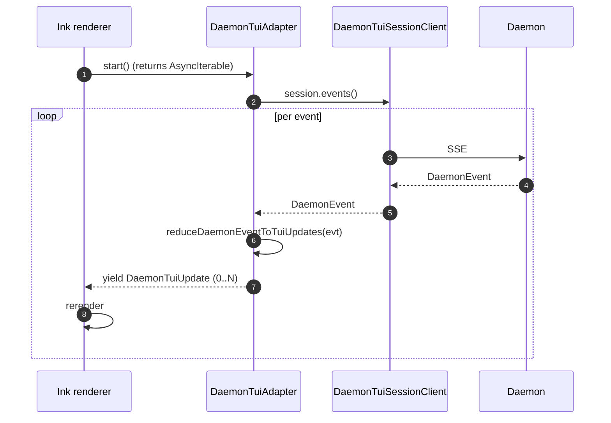

# CLI TUI Daemon 适配器
## 概览

`packages/cli/src/ui/daemon/DaemonTuiAdapter.ts` 是实验性适配器，让 CLI 的 Ink TUI **不再**在进程内 spawn `Config` + agent 运行时，改成跟在跑的 `qwen serve` daemon 通话。这是 Mode-B 客户端迁移的 dogfood 路径，其他适配器（channels、IDE、Web）都复用本适配器验证过的同一份 SDK 胶水。

TUI 从适配器拿到两样东西：

1. 一条 `AsyncIterable<DaemonTuiUpdate>` 流，喂给已有渲染循环。
2. 一个 `DaemonTuiSessionClient` 接口，用来调 `prompt`、`cancel`、`setModel`、`respondToPermission`。

特性由 `--experimental-daemon-tui`（外加 `QWEN_DAEMON_URL`）门控；老的进程内路径仍是默认。设计草案在 [`../daemon-client-adapters/tui.md`](../daemon-client-adapters/tui.md)，本文讲实际落地在 `DaemonTuiAdapter.ts` 的东西。

## 职责

- 用一层薄薄的 `DaemonSessionClient` 门面替换进程内 `QwenAgent` 路径。
- 把 daemon 事件映射成 TUI 形态的更新（`history`、`permission_request`、`permission_resolved`、`tool_group_update`、`model_switched`、`disconnected`）。
- 把权限请求作为可操作的 UI 浮到 Ink 渲染循环，而不是原始事件。
- 探测终态帧（`session_died`、`client_evicted`、`stream_error`），发一个 `disconnected` update，TUI 渲清晰的失败模式。
- 允许 stop 后受控重启（用户在 daemon 抖动后重试）。

## 架构

### 公开 surface

```ts
class DaemonTuiAdapter {
  constructor(session: DaemonTuiSessionClient, opts?: DaemonTuiAdapterOptions);
  start(): AsyncIterable<DaemonTuiUpdate>;
  prompt(req: PromptRequest): Promise<PromptResult>;
  cancel(): Promise<void>;
  setModel(modelServiceId: string): Promise<void>;
  respondToPermission(req: PermissionResponseRequest): Promise<void>;
  stop(): Promise<void>;
  restartAfterStop?: boolean; // stop 后受控重入
}

interface DaemonTuiSessionClient {
  prompt(req): Promise<PromptResult>;
  events(): AsyncIterable<DaemonEvent>;
  cancel(): Promise<void>;
  setModel(id): Promise<void>;
  respondToPermission(req): Promise<void>;
}

type DaemonTuiUpdate =
  | { kind: 'history'; value: HistoryItemWithoutId }
  | { kind: 'permission_request'; value: PermissionRequestUpdate }
  | { kind: 'tool_group_update'; value: ToolGroupUpdate }
  | { kind: 'permission_resolved'; value: PermissionResolvedUpdate }
  | { kind: 'model_switched'; value: ModelSwitchedUpdate }
  | { kind: 'disconnected'; value: DisconnectedUpdate };
```

### `reduceDaemonEventToTuiUpdates`（纯映射）

`DaemonTuiAdapter.ts:466-612` 的纯函数，把一条 `DaemonEvent` 映射成 0..N 条 `DaemonTuiUpdate`。相关映射：

| daemon event                                                       | TUI update                                                      |
| ------------------------------------------------------------------ | --------------------------------------------------------------- |
| `session_update`（`agent_message_chunk`）                          | `history`（追加 assistant 文本）                                |
| `session_update`（`agent_thought_chunk`）                          | `history`（追加思考）                                           |
| `session_update`（`tool_call`、`plan`）                            | `tool_group_update`                                             |
| `permission_request`                                               | `permission_request`                                            |
| `permission_resolved`                                              | `permission_resolved`                                           |
| `permission_partial_vote`                                          | 忽略（dogfood 路径暂不渲染 consensus 进度）                     |
| `permission_forbidden`                                             | `permission_resolved`（自身终态）                               |
| `model_switched`                                                   | `model_switched`                                                |
| `model_switch_failed`                                              | `history`（错误 toast）                                         |
| `session_died`、`session_closed`、`client_evicted`、`stream_error` | `disconnected`                                                  |
| MCP guardrail / mutation / auth flow                               | `history`（informational toast）或忽略 —— dogfood 路径暂未绑 UI |

函数刻意保持纯，TUI 渲染循环能从缓冲重放（终端 resize 时），映射本身也能不依赖 Ink 运行时做单测。

### 底层传输

session client 是 `DaemonTuiSessionClient` —— 一个薄薄的协议接口，适配器从 SDK 的 `DaemonSessionClient` 构造（整套 [`13-sdk-daemon-client.md`](./13-sdk-daemon-client.md) 都适用）。适配器不直接依赖 `DaemonClient`/`DaemonSessionClient`：它接接口，方便测试注入 stub。

## 流程

### Start + 渲染



### 权限提示

```mermaid
sequenceDiagram
    autonumber
    participant Ink
    participant A
    participant S
    participant D

    D-->>S: permission_request event
    S-->>A: DaemonEvent
    A-->>Ink: DaemonTuiUpdate { kind: 'permission_request', value }
    Ink->>Ink: render prompt UI; user selects option
    Ink->>A: respondToPermission(req)
    A->>S: session.respondToPermission(req)
    S->>D: POST /permission/:requestId
    D-->>S: 200 OR 409 already_resolved OR 403 forbidden
```

### 终态帧 → disconnected

```mermaid
sequenceDiagram
    autonumber
    participant D as Daemon
    participant S as SessionClient
    participant A as Adapter
    participant Ink

    D-->>S: session_died (or session_closed / client_evicted / stream_error)
    S-->>A: DaemonEvent
    A-->>Ink: { kind: 'disconnected', value: { reason, recoverable } }
    A->>A: stop() (close SSE iterator; mark restartAfterStop = true if recoverable)
```

## 状态与生命周期

- `start()` 幂等 —— 没 `stop()` 就再次调用会被拒。适配器最多一条活 SSE 订阅。
- `stop()` 通过内部 `AbortController` abort SSE iterator，消费方 `for await` unwind。
- `restartAfterStop` 给调用方（TUI bootstrap）参考，决定是否新建适配器指向同一 session id。
- 权限响应是 best-effort —— 请求已被 resolved / forbidden 时适配器把 SDK error 浮到 TUI 显示瞬时 toast 而不是 crash。

## 依赖

- `packages/sdk-typescript/src/daemon/DaemonSessionClient.ts`（`DaemonTuiSessionClient` 的 canonical 实现）。
- `packages/sdk-typescript/src/daemon/events.ts`（`narrowDaemonEvent`、payload 类型）。
- CLI 的 Ink renderer（消费 `DaemonTuiUpdate`）。

## 配置

| 旋钮                        | 位置      | 效果                                  |
| --------------------------- | --------- | ------------------------------------- |
| `--experimental-daemon-tui` | CLI 参数  | 选这条适配器路径而不是进程内默认      |
| `QWEN_DAEMON_URL`           | Env / CLI | daemon base URL                       |
| `QWEN_DAEMON_TOKEN`         | Env / CLI | Bearer token（透传给 `DaemonClient`） |
| `QWEN_DAEMON_WORKSPACE`     | Env / CLI | 覆盖 `POST /session` 的 `cwd`         |

预检：`--experimental-daemon-tui` 模式下 CLI 拒绝启动，除非 `/capabilities` 广播 `session_create`、`session_prompt`、`session_events`。

## 注意 & 已知局限

- **实验，非默认**。老进程内路径仍是主路径，本适配器是 Mode-B 迁移的 dogfood；迁移阻塞项见 [`../daemon-client-adapters/tui.md`](../daemon-client-adapters/tui.md)。
- **没有 consensus 进度 UI**。`permission_partial_vote` 被忽略，dogfood 路径范围外。
- **暂无 dual-output / stream-json 一致**。JSONL / stream-json 适配器期望进程内路径的结构化输出，这适配器没重建。
- **`reduceDaemonEventToTuiUpdates` 是全部映射契约**。新事件或新字段必须在那里处理；漏了静默丢 UI 更新。
- **重连由调用方驱动**，不在适配器内部。TUI bootstrap 在 `disconnected` 更新后决定是否新建适配器。

## 参考

- `packages/cli/src/ui/daemon/DaemonTuiAdapter.ts:33-905`
- 草案设计：[`../daemon-client-adapters/tui.md`](../daemon-client-adapters/tui.md)
- SDK 参考：[`13-sdk-daemon-client.md`](./13-sdk-daemon-client.md)
- 事件参考：[`09-event-schema.md`](./09-event-schema.md)
