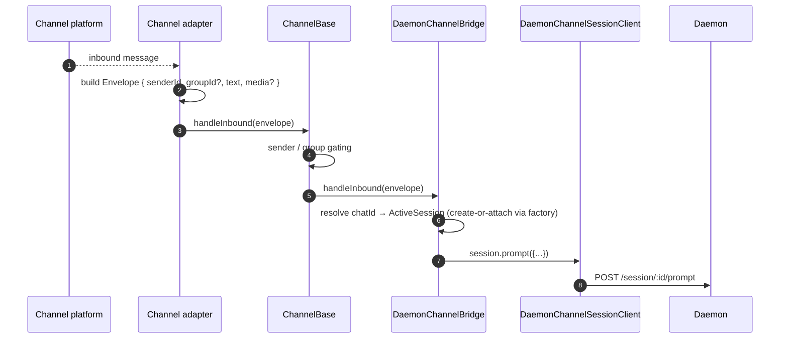
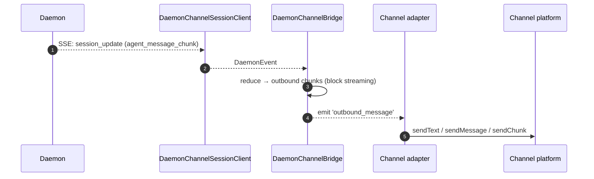
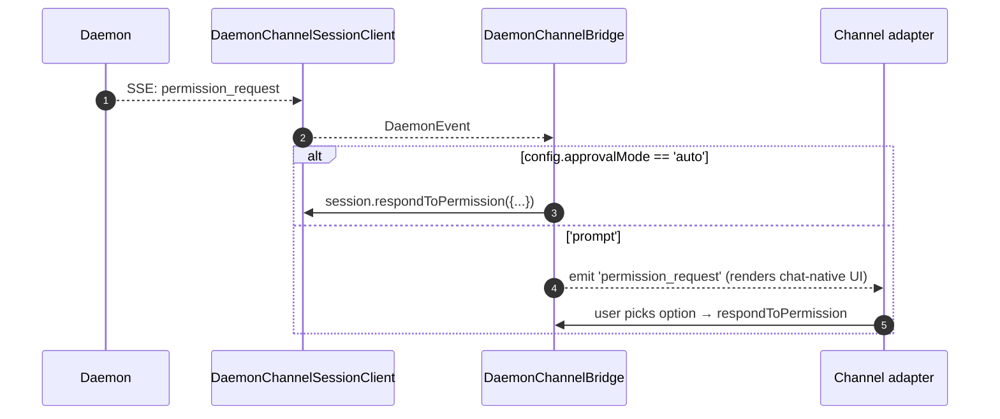

# Channel 适配器
## 概览

`packages/channels/` 是 **IM 渠道适配器**，把聊天平台的入站消息翻成 daemon prompt，把 daemon 的出站事件翻回平台消息。现已落地三个具体渠道：钉钉、微信（Weixin）、Telegram。它们共享 `packages/channels/base/` 基座加 `DaemonChannelBridge` —— 后者做 session 多路复用 + SSE 消费。

每个渠道按可配的 `SessionScope`（`per-sender` / `per-group` 等）把一段会话（或一群）映射到一个 daemon session。适配器委托给 `DaemonChannelBridge`，bridge 委托给 SDK 的 `DaemonSessionClient`（见 [`13-sdk-daemon-client.md`](./13-sdk-daemon-client.md)）。

## 职责

- 从渠道原生传输（钉钉 WebSocket 流、微信 HTTP 长轮询、Telegram Bot 长轮询）收入站消息。
- 通过 `DaemonChannelSessionFactory` 把 `(senderId, groupId?)` 解析成 daemon session。
- 把用户消息转成 daemon prompt 并把响应流式回写为出站消息，必要时切块。
- 渠道原生交互式 prompt 渲染权限请求；非交互时按 `ChannelConfig.approvalMode` 自动批准。
- 应用 sender / group gating（白/黑名单）与内容规范化（markdown / HTML，按渠道）。

## 架构

### `DaemonChannelBridge`（共享基座，`packages/channels/base/src/DaemonChannelBridge.ts:1-179+`）

```ts
class DaemonChannelBridge extends EventEmitter {
  constructor(opts: {
    sessionFactory: DaemonChannelSessionFactory;
    config: ChannelConfig;
  });
  handleInbound(envelope: Envelope): Promise<void>;
  shutdown(): Promise<void>;
}
```

持有 `Map<chatId, ActiveSession>`，key 是渠道的 chat id（sender / group）。每条记录包括：

- `DaemonChannelSessionClient`（去掉渠道无关方法的 `DaemonSessionClient`）。
- 一条 live SSE 消费 pump。
- debounce 的 prompt 组装器（适配把用户输入拆成多条入站消息的平台）。
- 每请求的自动批准策略。

发的事件：`permission_request`、`permission_resolved`、`outbound_message`、`stream_error`、`session_died`。渠道适配器把它们接到平台原生 API。

### `ChannelBase`（`packages/channels/base/src/ChannelBase.ts`）

每个适配器继承的抽象基：

```ts
abstract class ChannelBase {
  abstract start(): Promise<void>;
  abstract sendOutbound(target, payload): Promise<void>;
  handleInbound(envelope: Envelope): Promise<void>; // → bridge.handleInbound
  shutdown(): Promise<void>;
}
```

承担共性：sender / group gating、块流式发送（块大小、节流）、入站去抖。

### 各渠道适配器

| 适配器         | 文件                                                       | 传输                              | 备注                                                                        |
| -------------- | ---------------------------------------------------------- | --------------------------------- | --------------------------------------------------------------------------- |
| 钉钉           | `packages/channels/dingtalk/src/DingtalkAdapter.ts:79-586` | DingTalk Stream SDK WebSocket     | 通过 `sessionWebhook` POST 出站；媒体图片走 DT API 下载，base64 进 envelope |
| 微信（Weixin） | `packages/channels/weixin/src/WeixinAdapter.ts:33-309`     | iLink Bot HTTP 长轮询             | 通过专有 `sendText` / `sendImage` 出站；带打字指示                          |
| Telegram       | `packages/channels/telegram/src/TelegramAdapter.ts:19-308` | Telegram Bot API 长轮询（grammy） | 通过 `sendMessage` 发 HTML 块                                               |

每个适配器实现：

1. 入站传输（订阅 / 轮询消息）。
2. 构造 envelope（`{ senderId, groupId?, text, media?, raw }`）。
3. sender / group gating（委托给 `ChannelBase`）。
4. 出站序列化（markdown → HTML / WeChat 原生 / DingTalk 原生）。
5. 生命周期（start / shutdown）。

### 适配器矩阵

| 适配器       | 传输           | 身份                                       | 权限 UX                   | 自动批准                                          |
| ------------ | -------------- | ------------------------------------------ | ------------------------- | ------------------------------------------------- |
| **钉钉**     | WebSocket 流   | `senderStaffId`（群里 + `conversationId`） | 通过 DT markdown 内联按钮 | `ChannelConfig.approvalMode = 'auto' \| 'prompt'` |
| **微信**     | HTTP 长轮询    | `senderWxid`（群里 + `groupWxid`）         | 纯文本提示 + 回复 token   | 同上                                              |
| **Telegram** | Bot API 长轮询 | `from.id`（群里 + `chat.id`）              | inline keyboard 按钮      | 同上                                              |

## 流程

### 入站 prompt



### SSE 驱动出站



### 权限自动批准



## 状态与生命周期

- `DaemonChannelBridge` 与渠道适配器同生命周期；里面的 session 按 chat 维度活。
- 每个 chat session 在 SSE 掉的时候自动重连 —— `DaemonSessionClient.events()` 跟踪 `lastSeenEventId`，重放正确。
- `shutdown()` 关掉所有活 session 和底层传输（渠道的 WebSocket / 长轮询）。
- 钉钉 WebSocket 流支持 server-push；微信长轮询空响应需 backoff；Telegram 长轮询自带 `timeout` 参数。

## 依赖

- `packages/channels/base/` —— `ChannelBase`、`DaemonChannelBridge`、`types.ts`（`ChannelConfig`、`Envelope`、`SessionScope`、`ChannelPlugin`）。
- `packages/sdk-typescript/src/daemon/` —— `DaemonSessionClient` 等。
- 各渠道 SDK：`@dingtalk/stream`（钉钉）、专有 iLink Bot HTTP（微信）、`grammy`（Telegram）。

## 配置

`ChannelConfig`（`packages/channels/base/src/types.ts:1-121`）：

| 旋钮                                     | 效果                                                      |
| ---------------------------------------- | --------------------------------------------------------- |
| `sessionScope`                           | `'per-sender'`、`'per-group'`、`'per-thread'`（渠道定义） |
| `approvalMode`                           | `'auto'`（自动应答） / `'prompt'`（渲染 UI）              |
| `allowlist?: string[]`                   | 允许的 sender id，缺省 = 开放                             |
| `denylist?: string[]`                    | 拒绝的 sender id                                          |
| `chunkSize`、`chunkIntervalMs`           | 出站块流参数                                              |
| `daemon: { baseUrl, token?, clientId? }` | 传给 `DaemonChannelSessionFactory`                        |

每渠道还有自己的 key（钉钉：`streamCredentials`；微信：`ilinkUrl`、`botId`；Telegram：`botToken`）。

## 注意 & 已知局限

- **渠道**不直接** import `@qwen-code/sdk`**。走 `ChannelBase` → `DaemonChannelBridge` → `DaemonChannelSessionClient`（bridge 从 SDK 构造）。这层间接让 bridge 可以换实现（如测试 stub），渠道无感。
- **权限 UX 各渠道不同**。钉钉用 markdown 按钮；微信纯文本；Telegram 用 inline keyboard。还没共享的「交互式权限组件」抽象。
- **自动批准是部署侧决策**，不是 daemon 侧。daemon 的 `permission_mediation` 策略仍然生效；自动批准只是渠道不问人而已。不要把 `auto` 与 `enforce` 级工作流叠加。
- **每渠道限流 / 单消息大小**是适配器的责任。`DaemonChannelBridge` 只切块；微信单消息大小、Telegram flood 限制需要适配器处理。
- **无钉钉 / 微信 / Telegram 反向调用** —— 渠道是单向（chat → daemon → chat）。IM 原生 push（如 DT 卡片回调）还没接到 bridge。

## 参考

- `packages/channels/base/src/DaemonChannelBridge.ts:1-179+`
- `packages/channels/base/src/ChannelBase.ts`
- `packages/channels/base/src/types.ts:1-121`
- `packages/channels/dingtalk/src/DingtalkAdapter.ts:79-586`
- `packages/channels/weixin/src/WeixinAdapter.ts:33-309`
- `packages/channels/telegram/src/TelegramAdapter.ts:19-308`
- `packages/channels/plugin-example/`（reference 插件骨架）
- 渠道插件指南：[`../channel-plugins.md`](../channel-plugins.md)。
- SDK 参考：[`13-sdk-daemon-client.md`](./13-sdk-daemon-client.md)。
