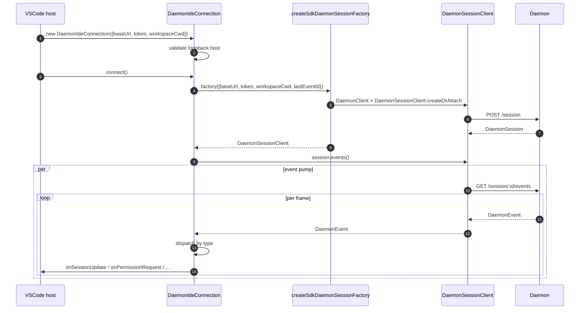
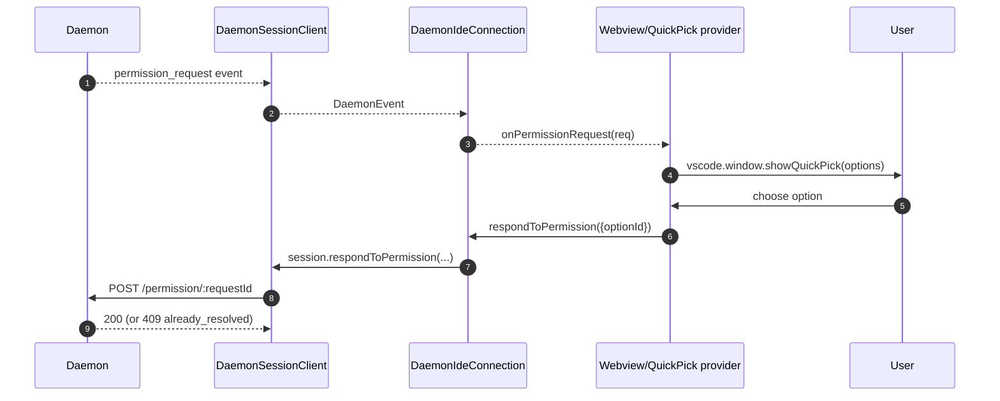

# VSCode IDE Daemon 适配器
## 概览

`packages/vscode-ide-companion/src/services/daemonIdeConnection.ts` 是 **VSCode 扩展的 daemon 适配器**。它让 IDE companion 通过 HTTP + SSE 跟在跑的 `qwen serve` daemon 通话，而不是启动一个进程内 `qwen --acp` stdio 子进程（老 `AcpConnectionState` 路径）。它是 VSCode 宿主侧 [`14-cli-tui-adapter.md`](./14-cli-tui-adapter.md) 的同级传输等价物。

IDE 的 chat webview 通过本适配器消费 daemon 事件；权限请求以 VSCode 原生 quick-pick 弹窗呈现。

## 职责

- 从 loopback 校验过的 `baseUrl` 构造 `DaemonClient` + `DaemonSessionClient`。
- 把 session client 的 SSE 事件按回调派发（`onSessionUpdate`、`onPermissionRequest`、`onAskUserQuestion`、`onEndTurn`、`onDisconnected`）。
- 构造时强制 **loopback only**（IDE 应当只与同主机 daemon 通话）。
- 把 daemon 事件桥接到 webview 的 `postMessage`，chat 面板保持同步。
- 通过 VSCode 原生 quick-pick UI 呈现权限请求。
- 把 `connect()` 串行化，避免宿主快速 double-call 时 race。

## 架构

### 公开 surface

```ts
class DaemonIdeConnection {
  constructor(opts: DaemonIdeConnectionOptions);
  connect(): Promise<void>;
  disconnect(): Promise<void>;
  prompt(req): Promise<PromptResult>;
  cancel(): Promise<void>;
  respondToPermission(req): Promise<void>;
  setModel(modelServiceId): Promise<void>;

  onSessionUpdate(cb: (update) => void): Disposable;
  onPermissionRequest(cb: (req) => void): Disposable;
  onAskUserQuestion(cb: (q) => void): Disposable;
  onEndTurn(cb: () => void): Disposable;
  onDisconnected(cb: (reason) => void): Disposable;
}

interface DaemonIdeConnectionOptions {
  baseUrl: string; // 必须 loopback（127.0.0.1 / localhost / [::1]）
  token?: string;
  workspaceCwd: string;
  modelServiceId?: string;
  lastEventId?: number;
}
```

### Loopback 校验

构造时（`daemonIdeConnection.ts:161-628`）：

```ts
const parsed = new URL(opts.baseUrl);
if (!isLoopbackHost(parsed.hostname)) {
  throw new Error('DaemonIdeConnection: baseUrl must be loopback (...)');
}
```

这是 **客户端硬约束**，与 daemon 自己的 `hostAllowlist`（见 [`12-auth-security.md`](./12-auth-security.md)）不同。IDE companion 永远不连远程 daemon —— 即便 operator 配了远程。理由：VSCode 的威胁模型假设 workspace 与 daemon 共享同一宿主（文件系统信任等）。

### `createSdkDaemonSessionFactory()`

`daemonIdeConnection.ts:144-159` 的工厂函数：从 `@qwen-code/sdk` 构造 `DaemonClient` 并调 `DaemonSessionClient.createOrAttach()`。connection 类持有工厂而不是直接实例化，方便测试注入 fake。

### 事件派发

connection 跑一个 SSE 消费者（`for await` over `session.events()`），按 type 路由：

| daemon event                                                       | IDE 回调                                 |
| ------------------------------------------------------------------ | ---------------------------------------- |
| `session_update`（多数子类型）                                     | `onSessionUpdate`                        |
| `session_update`（ask-user-question 变体）                         | `onAskUserQuestion`                      |
| `session_update`（end-turn 标记）                                  | `onEndTurn`                              |
| `permission_request`                                               | `onPermissionRequest`                    |
| `session_died`、`session_closed`、`client_evicted`、`stream_error` | `onDisconnected`（终态）                 |
| 其他（model、MCP、mutation、auth）                                 | 目前 no-op 或仅记日志，未来 webview 暴露 |

### Webview 桥接

connection 类**只做传输**。真正的 VSCode 集成住在 `packages/vscode-ide-companion/src/webview/providers/ChatWebviewViewProvider.ts` 等。Provider 订阅 connection 的回调并翻成 webview 的 `postMessage`。webview 自身用 `packages/webui/` 组件库渲染 —— 见 [`01-architecture.md`](./01-architecture.md) 的适配器矩阵。

### Connect 串行化

`connect()` 内部用队列，宿主快速 double-call（用户在握手中打开 panel 两次）不会 race。第二次 await 第一次；connection 最终落在一个确定状态。

## 流程

### 初次连接



### Quick-pick 权限



### 断开 / 恢复

```mermaid
sequenceDiagram
    autonumber
    participant D as Daemon
    participant SDK as DaemonSessionClient
    participant C as DaemonIdeConnection
    participant H as Host

    D-->>SDK: session_died (or other terminal)
    SDK-->>C: DaemonEvent
    C->>C: shut down pump
    C-->>H: onDisconnected(reason)
    H->>C: connect() (user-driven retry; resume lastEventId)
```

## 状态与生命周期

- 构造同步；**无网络 IO**，要等 `connect()`。
- `connect()` 通过内部队列幂等；二次调串行化。
- `disconnect()` 通过 `AbortController` 中止 SSE iterator 并清回调。
- `lastEventId` 在 disconnect 时从 SDK `DaemonSessionClient` 抓出来，下次 `connect()` 可再传以重放。

## 依赖

- `packages/sdk-typescript/src/daemon/` —— `DaemonClient`、`DaemonSessionClient`（真正的传输）。
- VSCode 扩展 API（`vscode.*`）—— 宿主 API、quick-pick、webview。
- `packages/webui/src/adapters/ACPAdapter.ts` —— webview 通过 `postMessage` 拿到 ACP 形态消息后渲染。

## 配置

| 旋钮                                         | 位置                | 效果                                                    |
| -------------------------------------------- | ------------------- | ------------------------------------------------------- |
| `baseUrl`                                    | 构造                | daemon URL；必须 loopback                               |
| `token`                                      | 构造                | Bearer token（通过 SDK 盖）                             |
| `workspaceCwd`                               | 构造                | `POST /session` 用；必须与 daemon 绑定的 workspace 一致 |
| `modelServiceId`                             | 构造 / `setModel()` | 初始 model                                              |
| `lastEventId`                                | 构造                | 恢复游标（一般从宿主状态恢复）                          |
| VSCode 设置 `qwen.ide.daemonUrl`（或等价键） | 工作区设置          | operator 配的 daemon URL                                |

## 注意 & 已知局限

- **Loopback only —— 构造时硬拒**。想让 IDE 指向远程 daemon 的 operator 需要 SSH port-forward / 本地代理；适配器永远不连非 loopback URL。
- **老 `AcpConnectionState` 路径仍是 IDE companion 的主路径**（stdio child）。本适配器是 Mode-B 迁移的同级传输；迁移阻塞项与计划中的 `BridgeFileSystem` 一致工作见 [`../daemon-client-adapters/ide.md`](../daemon-client-adapters/ide.md)。
- **HTTP 上暂无反向 RPC / 编辑器原生能力 surface**。需要 agent 回调 IDE 的功能（只读 buffer 访问、diff 预览集成）目前只在 stdio 路径有。
- **Webview ↔ connection 耦合由宿主拥有**，不在本适配器。不要把 webview 专属逻辑塞进 `DaemonIdeConnection`。
- **`workspaceCwd` 与 daemon 绑定不一致** → `400 workspace_mismatch`，应当作清晰的配置错误暴露，不要重试。

## 参考

- `packages/vscode-ide-companion/src/services/daemonIdeConnection.ts:161-628`
- `packages/vscode-ide-companion/src/services/daemonIdeConnection.ts:144-159`（`createSdkDaemonSessionFactory`）
- `packages/vscode-ide-companion/src/types/connectionTypes.ts:1-42`（老 `AcpConnectionState`）
- `packages/vscode-ide-companion/src/webview/providers/ChatWebviewViewProvider.ts`（webview bridge）
- `packages/webui/src/adapters/ACPAdapter.ts`（webview ACP-message 适配器）
- 草案设计：[`../daemon-client-adapters/ide.md`](../daemon-client-adapters/ide.md)
- SDK 参考：[`13-sdk-daemon-client.md`](./13-sdk-daemon-client.md)
